  # Instalacion -> Contenedores de Bases de Datos en WSL con Docker

En este documento detallo el proceso personal que sigo para levantar mis motores de bases de datos utilizando contenedores. La idea es tener un entorno ordenado, conectado mediante una red propia y listo para trabajar en los proyectos.

---

## 1. Comprobación rápida del entorno

Antes de meterme de lleno con los servicios, siempre me gusta asegurar que mi máquina (usando WSL) tiene Docker respirando y listo para la acción. 

```bash
sudo systemctl is-active docker
docker compose version
docker --version
```
 

**Resultado y evidencia (imagen):**

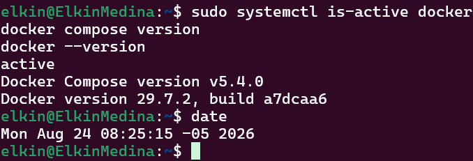

**Resultado:** Con esto confirmo de un solo vistazo que el daemon está arriba y que las versiones de Docker y Docker Compose responden sin problemas.  

##  Creación de directorios y estructura
Abro mi terminal y ejecuto los comandos necesarios para levantar los directorios de los tres motores. Después, valido la distribución de las carpetas:

```bash
mkdir ia-lab
cd ia-lab
```
```bash
mkdir -p services/motores-bd/{mysql,postgres,mssql,oracle} data/{mysql,postgres,mssql,oracle}
tree
```
La estructura que debo obtener es:
```
~/ia-lab/
├── services/
│   └── motores-bd/
│       ├── mysql/
│       ├── postgres/
│       ├── mssql/
|       |__ oracle/
└── data/
  ├── mysql/
  ├── postgres/
  └── mssql/
  └── oracle/
```
**Resultado y evidencia (imagen):**

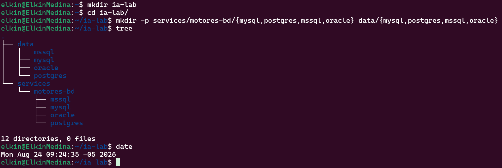

**Resultado:** Ejecuté mkdir -p para crear las carpetas de servicios y datos, y verifiqué con tree que todos los directorios quedaran organizados perfectamente para MySQL, PostgreSQL, MS SQL Server y Oracle.

## Creación de la red Docker compartida

Creo una red Docker compartida para que todos los contenedores puedan comunicarse entre sí. Ejecuto este comando en mi terminal WSL:

```bash
sudo docker network inspect ia-lab-network >/dev/null 2>&1 || docker network create ia-lab-network
```

Verifico que la red se haya creado correctamente:

```bash
sudo docker network ls | grep ia-lab
```

**Evidencia (imagen):**

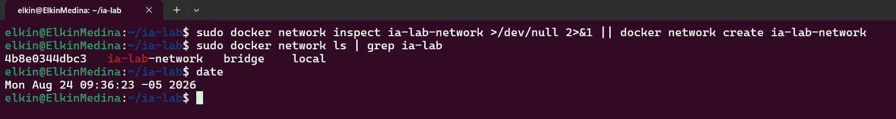

**Resultado:** Ejecuté el comando para levantar la red en la terminal y verifiqué que todo saliera bien. Como se ve en la salida, la red ia-lab-network se creó sin problemas con el identificador `4b8e0344dbc3` y quedó configurada como una red bridge local en Docker.

## MySQL

## Crear el archivo `docker-compose.yml`

Creo el archivo de configuración de MySQL dentro de la carpeta correspondiente usando el siguiente comando:

```bash
cat > ~/ia-lab/services/motores-bd/mysql/docker-compose.yml << 'EOF'
services:
  mysql:
    image: mysql:8.0
    container_name: mysql-server
    restart: unless-stopped
    env_file:
      - .env
    ports:
      - "3306:3306"
    volumes:
      - ../../../data/mysql:/var/lib/mysql
      - /mnt/d/academia/bd:/backups
    command: >
      --character-set-server=utf8mb4
      --collation-server=utf8mb4_unicode_ci
      --bind-address=0.0.0.0
    networks:
      - ia-lab-network
    healthcheck:
      test: ["CMD", "mysqladmin", "ping", "-h", "localhost"]
      interval: 10s
      timeout: 5s
      retries: 5
      start_period: 30s

networks:
  ia-lab-network:
    external: true
EOF
```

Evidencia de la incorporación del código:


**Evidencia (imagen):**

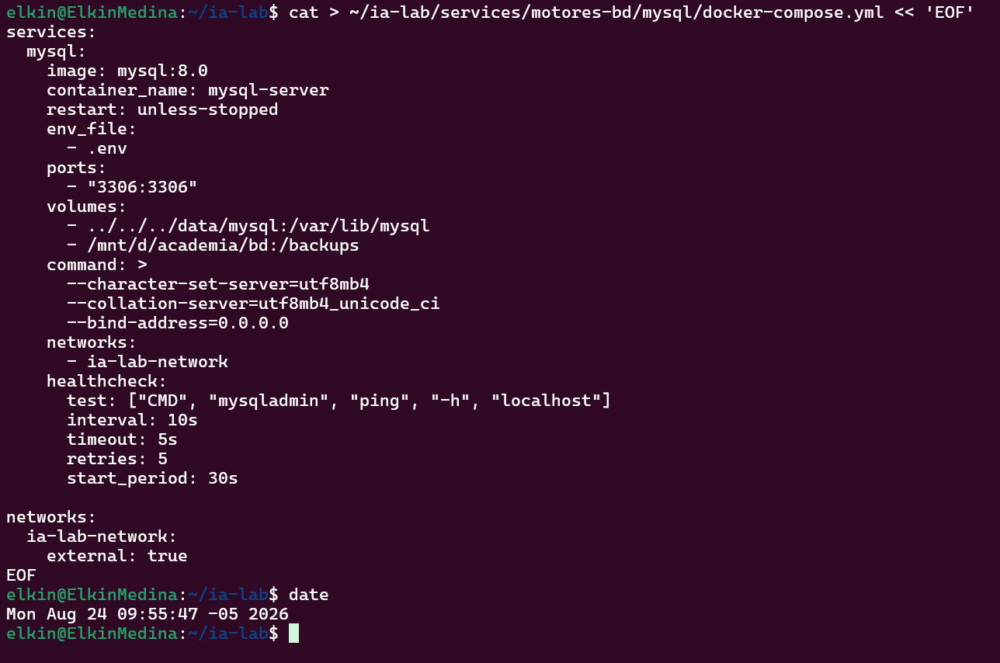

###  Crear el archivo `.env`

Creo el archivo `.env` para configurar la zona horaria, la contraseña del usuario administrador y el nombre de la base de datos de MySQL:

```bash
cat > ~/ia-lab/services/motores-bd/mysql/.env << 'EOF'
TZ=America/Bogota
MYSQL_ROOT_PASSWORD=1234
MYSQL_DATABASE=ActivaFit
EOF
```

**Evidencia (imagen):**

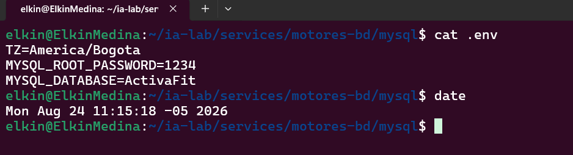

## Creación de la documentación (`README.md`)

Para dejar rastro de los accesos y detalles técnicos de este motor, genero un archivo `README.md` directamente en la carpeta de MySQL:

```bash
touch ~/ia-lab/services/motores-bd/mysql/README.md
```
Lo abro con el editor para redactar la información clave:

```bash
sudo nano ~/ia-lab/services/motores-bd/mysql/README.md
```
Y le guardé el siguiente contenido de referencia:

```markdown
# MySQL 8.0 - Motor de Base de Datos

> **Acceso remoto habilitado.** Puerto expuesto en `0.0.0.0:3306`.
> **Usuario por defecto:** `root`
> **Base de datos inicial:** `ActivaFit`
> **Password:** `1234`
```
---


**Evidencia (imagen):**

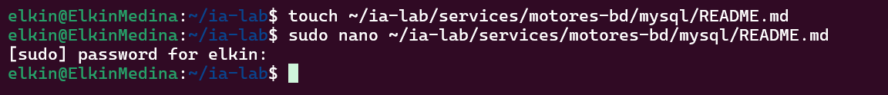
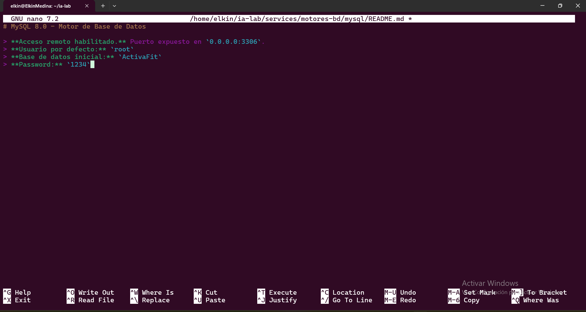

## Conectar desde WSL (local)
```bash
sudo docker exec -it mysql-server mysql -u root -p
# Password: 1234
```
**Evidencia (imagen):**
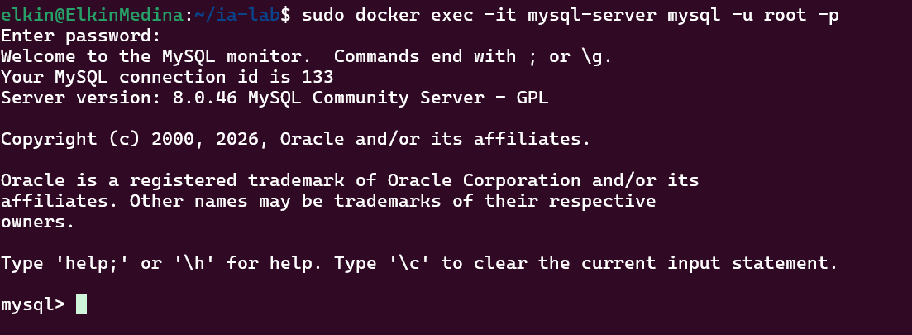

## Pongo en marcha el MySQL

Me muevo a la carpeta del servicio y ejecuto el comando para levantar el contenedor en segundo plano:

```bash
cd ~/ia-lab/services/motores-bd/mysql
sudo docker compose up -d
```
Verifico que el contenedor esté corriendo:
```bash
sudo docker ps | grep mysql-server
```
### Detener el contenedor de MySQL

Si en algún momento necesito apagar el servicio para hacer ajustes, me ubico en la carpeta y detengo el contenedor:

```bash
cd ~/ia-lab/services/motores-bd/mysql
sudo docker compose down
```
**Evidencia (imagen):**

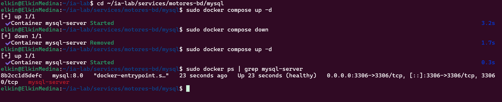

## Creación de mi usuario y base de datos con acceso remoto

Para no depender siempre del usuario root y dejar configurado mi acceso personalizado, entré directo al contenedor de MySQL con mis credenciales de root:

```bash
sudo docker exec -it mysql-server mysql -u root -p
```
Ya dentro de la consola del motor, creé mi base de datos ActivaFit:
```SQL
-- Creé mi base de datos con soporte utf8mb4
CREATE DATABASE ActivaFit CHARACTER SET utf8mb4 COLLATE utf8mb4_unicode_ci;

-- Creé mi usuario con acceso remoto (%)
CREATE USER 'admin'@'%' IDENTIFIED BY '1234';

-- Le di privilegios totales sobre mi base de datos
GRANT ALL PRIVILEGES ON *.* TO 'admin'@'%';
GRANT ALL PRIVILEGES ON ActivaFit.* TO 'admin'@'%';
FLUSH PRIVILEGES;
EXIT;
``` 
**Evidencia (imagen):**

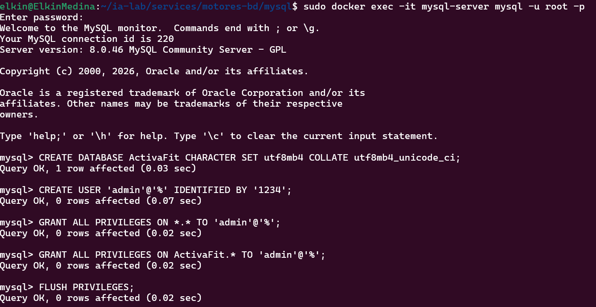
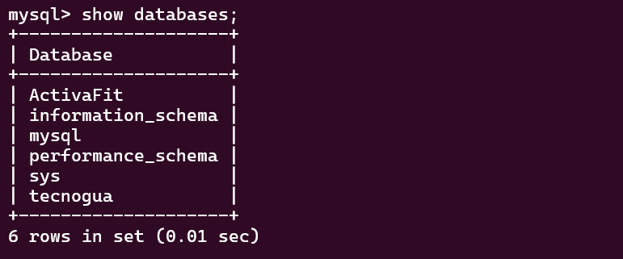

**Resultado:**
Dejé lista mi base de datos ActivaFit y configuré mi usuario admin con su contraseña, asegurándome de tener los permisos necesarios para conectar herramientas externas sin trabas.

## Conexión desde DBeaver 
Para comprobar que podía gestionar mis tablas desde una interfaz gráfica, saqué la IP de mi WSL ejecutando:

**Evidencia (imagen):**

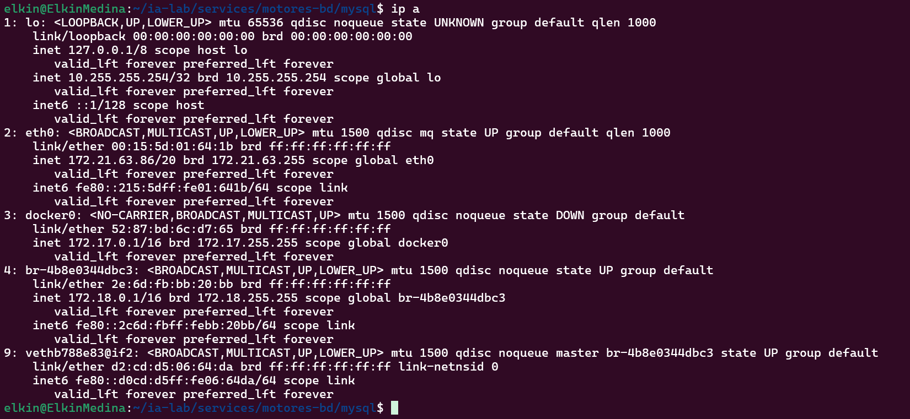

Con esa IP, configuré la nueva conexión en DBeaver usando estos datos:

| Parámetro | Valor |
|---|---|
| **Host** | 172.21.63.86 |
| **Puerto** | 3306 |
| **Base de datos** | ActivaFit |
| **Usuario** | admin |
| **Contraseña** | 1234 |

**Evidencia (imagen):**

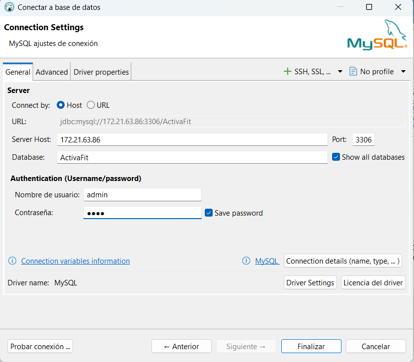
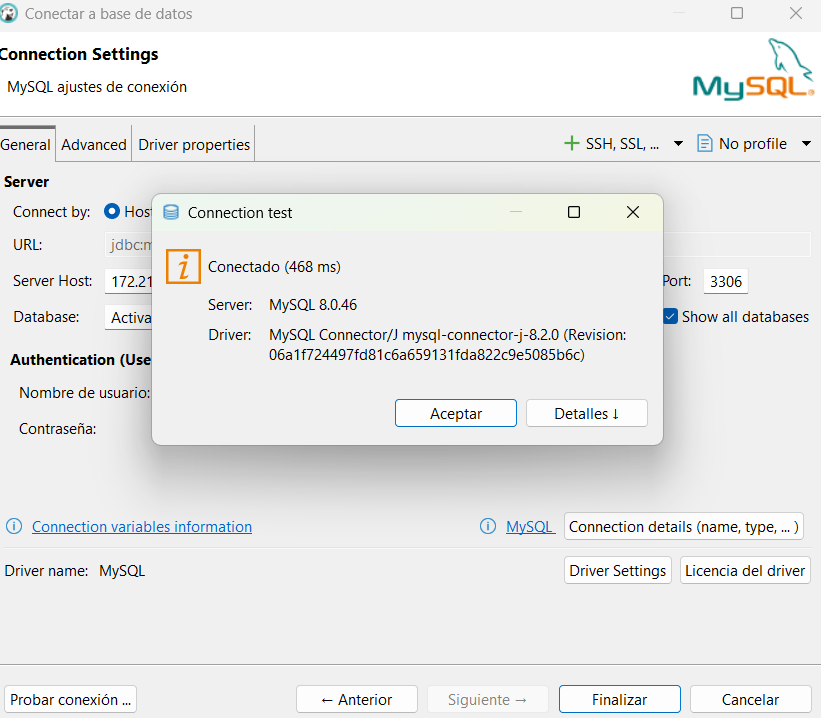
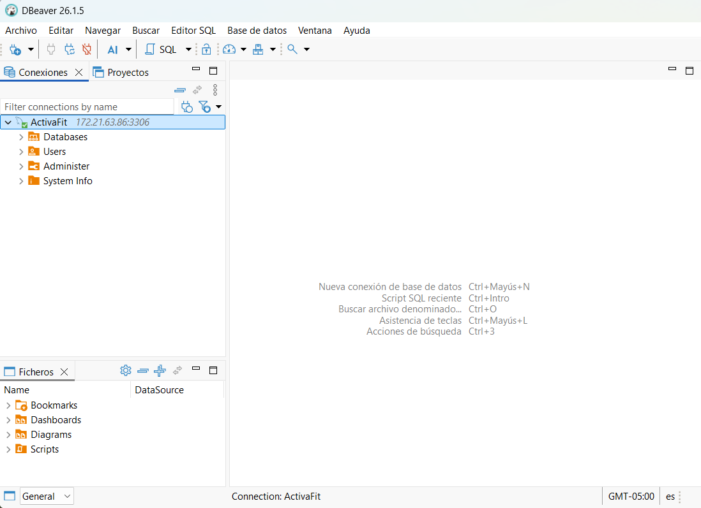

**Resultado:**
Probé la conexión remota desde DBeaver usando la IP de mi entorno y los datos que creé, logrando entrar al motor de forma exitosa.

## Creación de mi respaldo (Backup)
Para mantener mis datos seguros, automaticé una copia de seguridad de mi base de datos ActivaFit mandándola directo a la ruta compartida con mi equipo:


```bash
sudo docker exec -it mysql-server sh -c "mysqldump -u root -p1704 ActivaFit > /backups/backup_ActivaFit_\$(date +%Y%m%d).sql"
```
Para comprobar que la copia de seguridad se guardó correctamente en el equipo, listé el contenido de la ruta compartida con el siguiente comando:

```bash
ls -lh /mnt/d/academia/bd/
```
**Evidencia (imagen):**

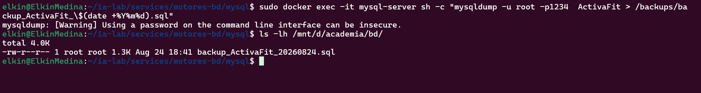

**Resultado:**
Verifiqué el directorio de respaldos y confirmé que el archivo .sql de la base de datos `ActivaFit` se generó con la fecha actual y el tamaño correspondiente, cerrando con éxito el proceso de exportación y persistencia.

### Conclusión

Con este registro finalizo la instalación y configuración del motor MySQL para mi proyecto **ActivaFit**. Dejé el contenedor funcionando, estructuré la base de datos, habilité el acceso remoto con un usuario propio, comprobé la conexión exitosa desde DBeaver y generé el respaldo correspondiente de forma automatizada.

## Configuración y Despliegue de PostgreSQL

Una vez finalizado MySQL, me dispongo a desplegar el motor de **PostgreSQL** dentro de la estructura de servicios de mi laboratorio.

### Creación del `docker-compose.yml` para PostgreSQL

Me ubiqué en la carpeta correspondiente al servicio de Postgres y creé el archivo de configuración utilizando un bloque `cat` para escribir directamente todo el contenido estructurado:

```bash
cat > ~/ia-lab/services/motores-bd/postgres/docker-compose.yml << 'EOF'
services:
  postgres:
    image: postgres:17
    container_name: postgres-server
    restart: unless-stopped

    env_file:
      - .env

    ports:
      - "5432:5432"

    volumes:
      # Datos persistentes dentro de WSL
      - ../../../data/postgres:/var/lib/postgresql/data

      # Backups accesibles desde Windows (D:)
      - /mnt/d/academia/bd:/backups

    command:
      - postgres
      - -c
      - "listen_addresses=*"

    networks:
      - ia-lab-network

    healthcheck:
      test: ["CMD-SHELL", "pg_isready -U $$POSTGRES_USER -d$$POSTGRES_DB"]
      interval: 10s
      timeout: 5s
      retries: 5
      start_period: 20s

networks:
  ia-lab-network:
    external: true
EOF
```
**Evidencia (imagen):**

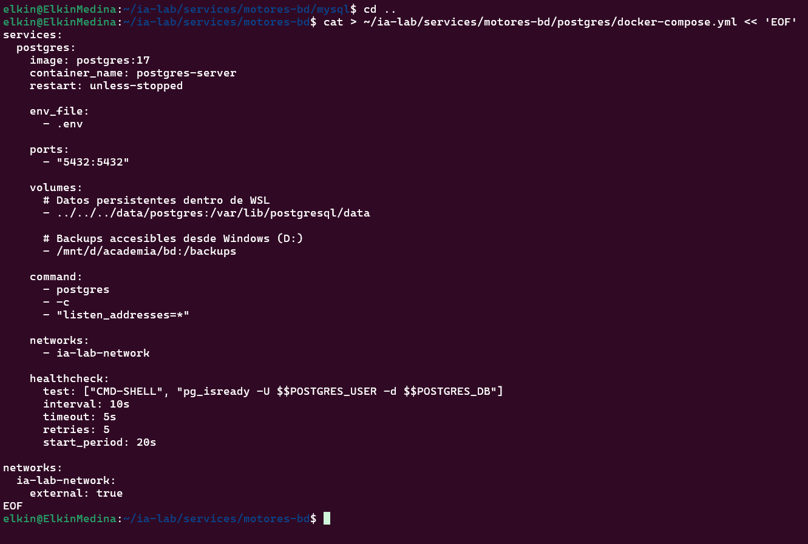

**Resultado:**
Dejé configurado el contenedor de PostgreSQL utilizando la imagen oficial postgres:17, enlazando el archivo de variables de entorno, mapeando el volumen de datos en WSL y conectándolo a la ruta de respaldos en Windows para mantener el mismo estándar que utilicé con MySQL.

## Creación del `.env`

Para mantener seguras las credenciales y separar la configuración del contenedor, creé el archivo `.env` dentro de la misma carpeta del servicio:

```bash
cat > ~/ia-lab/services/motores-bd/postgres/.env << 'EOF'
TZ=America/Bogota
POSTGRES_USER=postgres
POSTGRES_PASSWORD=1234
POSTGRES_DB=ActivaFit
EOF
```
**Evidencia (imagen):**

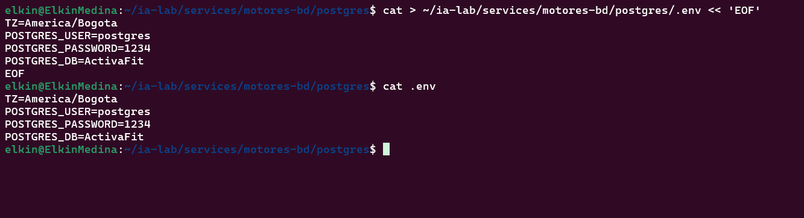

**Resultado:**
Definí las variables de entorno para PostgreSQL utilizando mi contraseña estándar (1234) y configurando la base de datos ActivaFit para que el motor la cree automáticamente al arrancar por primera vez.

## CReacion del README de PostgreSQL

Creé el archivo `README.md` dentro de la carpeta del motor:

```bash
touch ~/ia-lab/services/motores-bd/postgres/README.md
```

Después abro el archivo para agregar su contenido:

```bash
sudo nano ~/ia-lab/services/motores-bd/postgres/README.md
```

Y estructuré la información clave de acceso y configuración de la siguiente manera:

````markdown
# PostgreSQL 17 – Motor de Base de Datos

> **Acceso remoto habilitado:** Puerto expuesto en `0.0.0.0:5432`.
> **Usuario por defecto:** `postgres`
> **Base de datos inicial:** `ActivaFit`
> **Password:** `1234`

---

## Conectar desde WSL (local)

```bash
sudo docker exec -it postgres-server psql -U postgres -d ActivaFit
# Password: 1234
```
````

Después de guardar el contenido y luego Compruebo si se guardó bien :

```bash
cat ~/ia-lab/services/motores-bd/postgres/README.md
```

**Evidencia (imagen):**

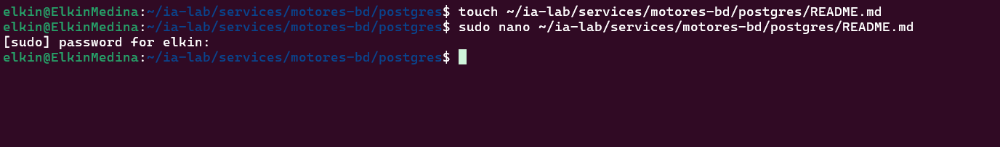
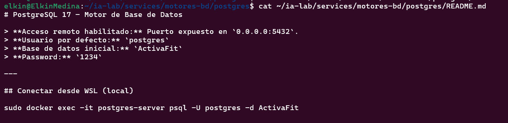

**Resultado:**
Documenté los detalles técnicos principales de PostgreSQL en el archivo README.md del servicio, dejando claras las credenciales y los parámetros de conexión para tenerlos siempre a la mano en el desarrollo del proyecto.

## Despliegue del contenedor de PostgreSQL

Una vez configurados el archivo `docker-compose.yml`, las variables de entorno y el `README.md`, procedí a levantar el contenedor utilizando Docker Compose:

```bash
cd ~/ia-lab/services/motores-bd/postgres 
```

```bash
sudo docker compose up -d
```
Verifico que el contenedor esté corriendo:

```bash
sudo docker ps | grep postgres-server
``` 

Verificar que esté corriendo sin problemas:
```bash
sudo docker ps
```

**Evidencia (imagen):**
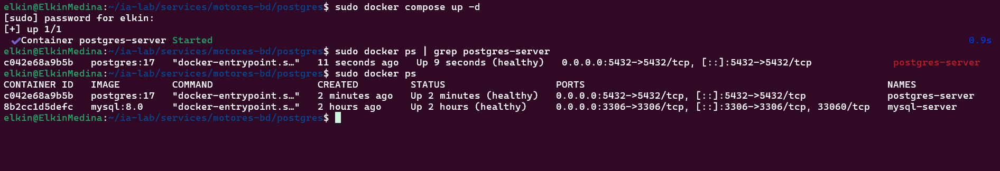

**Resultado:**
Inicié el despliegue del contenedor de PostgreSQL con Docker Compose. El sistema creó y puso en marcha el servicio postgres-server vinculado a la red y a los volúmenes configurados, quedando operativo de manera inmediata.

## Creacion del usuario con acceso remoto

Me conecto primero como `postgres` al motor de PostgreSQL:

```bash
sudo docker exec -it postgres-server psql -U postgres -d ActivaFit
```

Después de ingresar la contraseña de `postgres`, ejecuto las instrucciones SQL.


```sql
CREATE USER admin WITH PASSWORD '1234';
ALTER USER admin WITH SUPERUSER;
```
También puedo verificar que el usuario fue creado correctamente con:

```sql
\du
```
**Evidencia (imagen):**
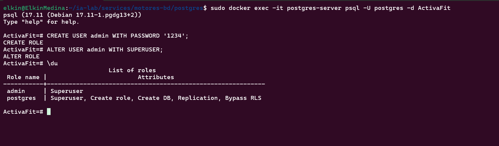

**Resultado:**
Verifiqué en la salida de la consola que el rol admin fue creado con éxito y cuenta con los privilegios de Superuser necesarios para la administración completa del motor y las conexiones remotas

## Conexión a PostgreSQL desde DBeaver

Para comprobar que el acceso remoto y el usuario que creé (`admin`) funcionan correctamente desde el entorno de Windows, abrí **DBeaver** y configuré una nueva conexión a PostgreSQL con los siguientes parámetros:

Para comprobar que podía gestionar mis tablas desde una interfaz gráfica, saqué la IP de mi WSL ejecutando:

**Evidencia (imagen):**

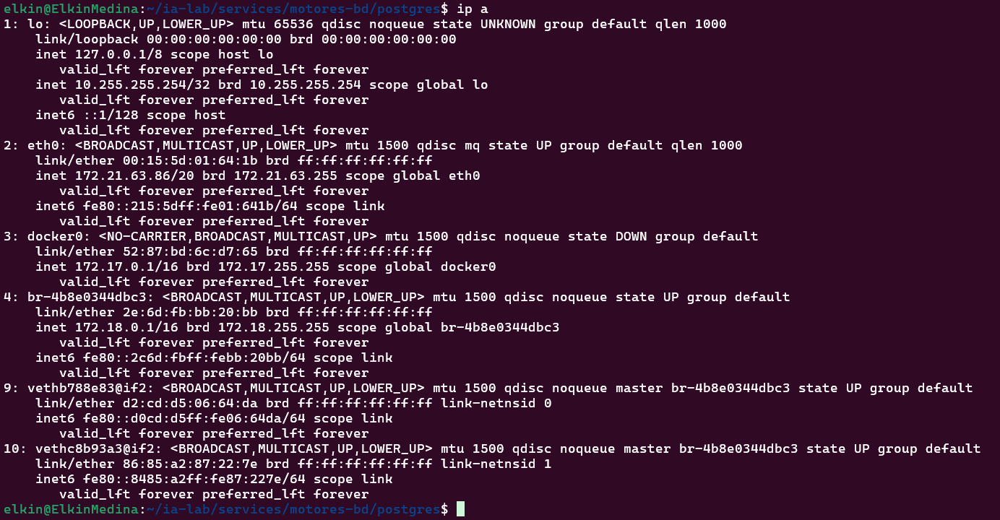

Con esa IP, configuré la nueva conexión en DBeaver usando estos datos:


  * **Host:** `172.21.63.86` 
  * **Puerto:** `5432`
  * **Base de datos:** `ActivaFit`
  * **Usuario:** `admin`
  * **Contraseña:** `1234`

**Evidencia (imagen):**

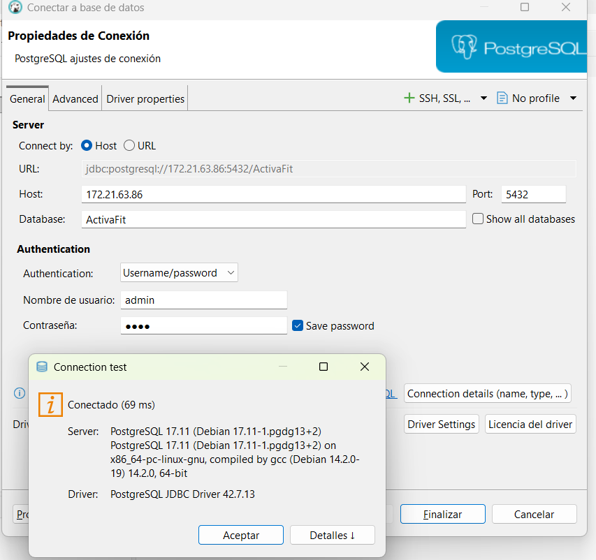
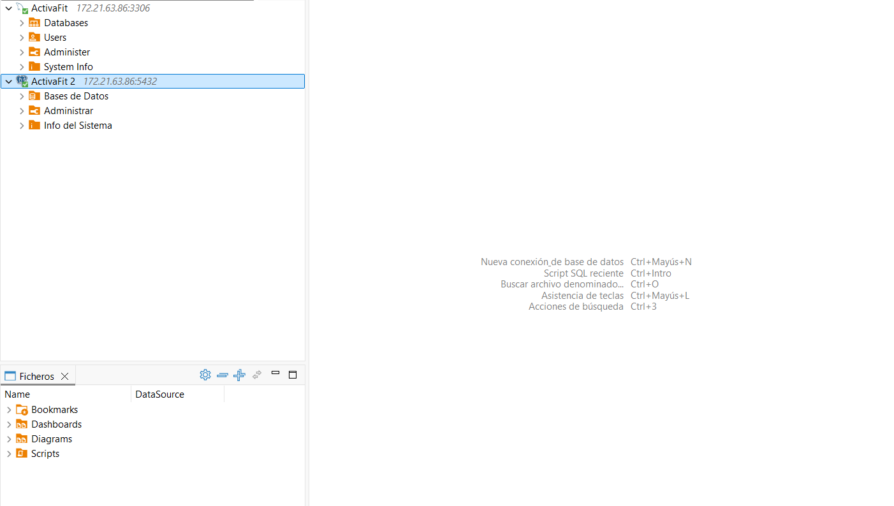

**Resultado:**
Probé la conexión remota desde DBeaver usando la IP de mi entorno y los datos que creé, logrando entrar al motor de forma exitosa.

## Respaldo (Backup) de la base de datos en PostgreSQL

Para asegurar una copia de seguridad de la estructura y los datos del proyecto, realicé un respaldo utilizando la herramienta nativa `pg_dump` ejecutada desde el contenedor:

```bash
sudo docker exec -it postgres-server pg_dump -U admin -d ActivaFit > backup_activafit.sql
``` 
Para comprobar que la copia de seguridad se guardó correctamente en el equipo, listé el contenido de la ruta compartida con el siguiente comando:

### Verificación del Respaldo (Backup)

Para comprobar que el archivo de respaldo se generó de forma íntegra y correcta en el sistema, verifiqué su existencia, su tamaño en el directorio y previsualicé sus primeras líneas de código SQL:

```bash
ls -lh backup_activafit.sql
head -n 20 backup_activafit.sql 
```
**Evidencia (imagen):**

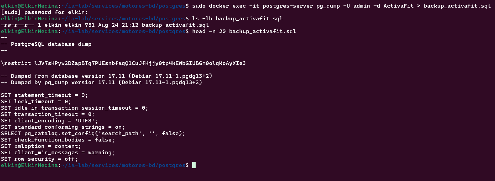

**Resultado:**
Comprobé la generación exitosa del archivo backup_activafit.sql con un tamaño de 751 bytes, validando las cabeceras del motor PostgreSQL y asegurando una copia de seguridad funcional para la base de datos del proyecto.

### Conclusión
El despliegue de PostgreSQL mediante Docker facilitó la configuración del servicio, la creación del usuario administrador con privilegios avanzados, la verificación de la conectividad desde DBeaver y la ejecución exitosa de respaldos con pg_dump.

## MS SQL Server

### Creación del archivo `docker-compose.yml`
Para el despliegue de SQL Server, configuré el archivo de servicios utilizando la imagen oficial de Microsoft con el siguiente contenido:

```bash
cat > ~/ia-lab/services/motores-bd/mssql/docker-compose.yml << 'EOF'
services:
  mssql:
    image: [mcr.microsoft.com/mssql/server:2022-latest](https://mcr.microsoft.com/mssql/server:2022-latest)
    container_name: mssql-server
    restart: unless-stopped
    user: root
    env_file:
      - .env
    ports:
      - "0.0.0.0:1433:1433"
    volumes:
      - ../../../data/mssql:/var/opt/mssql
      - /mnt/d/academia/bd:/backups
    networks:
      - ia-lab-network
    healthcheck:
      test: ["CMD-SHELL", "/opt/mssql-tools18/bin/sqlcmd -S localhost -U SA -P $$MSSQL_SA_PASSWORD -C -Q 'SELECT 1' || exit 1"]
      interval: 10s
      timeout: 5s
      retries: 10
      start_period: 40s

networks:
  ia-lab-network:
    external: true
```

**Evidencia (imagen):**

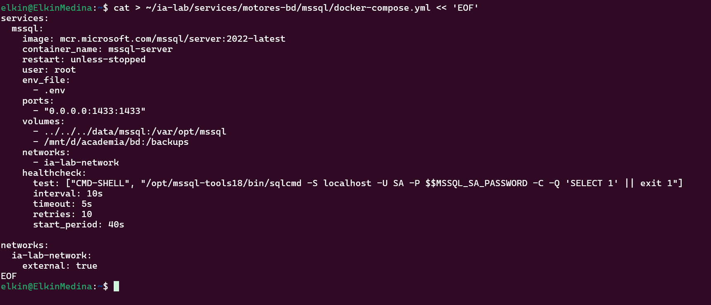

**Resultado:**
Estructuré el archivo de configuración para MSSQL, asegurando la persistencia de datos y el monitoreo de salud del contenedor mediante la herramienta nativa sqlcmd.

## Creación del  (`.env`)

Para definir los parámetros de aceptación de licencia y la contraseña del administrador del sistema (`SA`), creé el archivo `.env` con el siguiente contenido:

```bash
cat > ~/ia-lab/services/motores-bd/mssql/.env << 'EOF'
TZ=America/Bogota
ACCEPT_EULA=Y
MSSQL_SA_PASSWORD=Elkin1234!
MSSQL_PID=Developer
EOF
```

Si necesito editar el archivo posteriormente, utilizo:

```bash
cd ~/ia-lab/services/motores-bd/mssql
sudo nano .env
```
**Evidencia (imagen):**

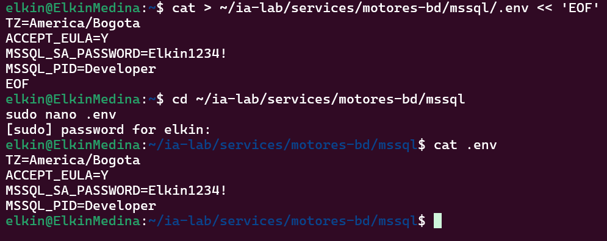

* **MSSQL_PID:** `Developer` (Define la edición de SQL Server utilizada en el contenedor).

* **Usuario SA:** Corresponde al Administrador del Sistema (System Administrator), necesario para conectarse mediante sqlcmd o DBeaver.

 * **Complejidad de contraseña:** Requisito obligatorio de SQL Server que exige incluir mayúsculas, minúsculas, números y símbolos.


**Resultado:**
Creé y verifiqué el archivo .env de MS SQL Server estableciendo la zona horaria, aceptando la licencia de usuario, configurando la edición Developer y definiendo una contraseña robusta para el usuario administrador SA, garantizando el cumplimiento de los estándares de seguridad exigidos por el motor.


## Creación del archivo `README.md`

Para documentar la finalidad y los parámetros del servicio de MS SQL Server en el repositorio, creé el archivo `README.md` ejecutando:
Creé el archivo `README.md` dentro de la carpeta del motor:

```bash
touch ~/ia-lab/services/motores-bd/mssql/README.md
```

Después abro el archivo para agregar su contenido:

```bash
sudo nano ~/ia-lab/services/motores-bd/mssql/README.md
```

```bash
# Configuración de Microsoft SQL Server (MSSQL)

Este directorio contiene la configuración mediante Docker Compose para desplegar una instancia de **SQL Server 2022** orientada al proyecto de base de datos.

## Estructura de archivos
- `docker-compose.yml`: Archivo de configuración del contenedor.
- `.env`: Variables de entorno para la configuración de la instancia (credenciales y licencia).

## Credenciales y Parámetros
- **Puerto:** `1433`
- **Usuario Administrador:** `SA`
- **Edición (`MSSQL_PID`):** `Developer`
- **Zona Horaria:** `America/Bogota`
```
Para ver el contenido del archivo `README.md`, ejecuto:

```bash
cat ~/ia-lab/services/motores-bd/mssql/README.md
```
**Evidencia (imagen):**

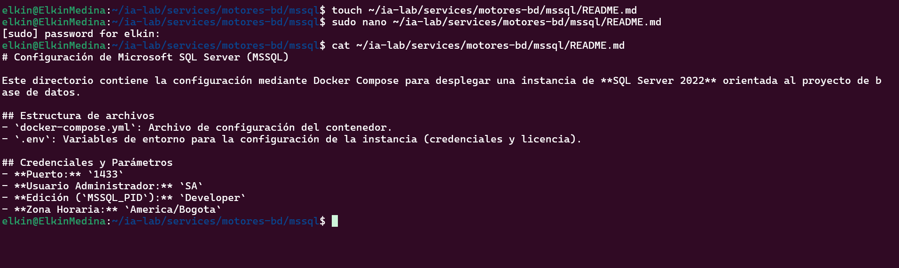

**Resultado:**
Documenté la configuración del motor MSSQL creando el archivo README.md con los detalles técnicos, puertos, usuario administrador y estructura del servicio.

## Despliegue del contenedor de MSSQL

Una vez configurados el archivo `docker-compose.yml`, el archivo de variables de entorno `.env` y la documentación, procedí a levantar el servicio ejecutando los siguientes comandos:

```bash
cd ~/ia-lab/services/motores-bd/mssql
docker compose up -d
```

Verifico que el contenedor `mssql-server` esté corriendo:

```bash
sudo docker ps | grep mssql-server
```
Para verificar el estado de ejecución del contenedor y su correcta inicialización, consulté los contenedores activos:


```bash
docker ps
```
**Evidencia (imagen):**

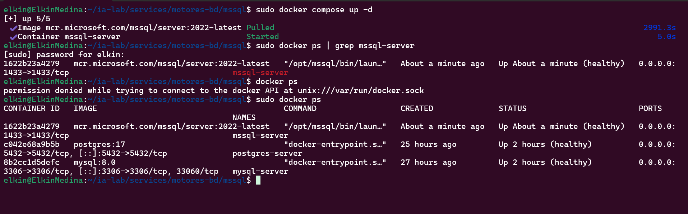

**Resultado:**
Ejecuté el despliegue del servicio de MS SQL Server mediante Docker Compose en modo desacoplado (-d), verificando que el contenedor iniciara correctamente y que el servicio estuviera operativo en el puerto 1433.

### Instalar `mssql-tools` en WSL

Estos pasos instalan `mssql-tools18` y `unixODBC` en Ubuntu 24.04 para administrar y conectarse a SQL Server ejecutado mediante Docker.

#### Actualizar e instalar los paquetes requeridos

```bash
sudo apt update && sudo apt install -y curl ca-certificates gnupg
```

####  Eliminar repositorios antiguos o duplicados de Microsoft

Esto evita conflictos con configuraciones anteriores de Ubuntu 22.04 (`jammy`) y con el método obsoleto `apt-key`.

```bash
sudo rm -f /etc/apt/sources.list.d/mssql-release.list
sudo rm -f /etc/apt/sources.list.d/microsoft-prod.list
```

####  Descargar el repositorio oficial de Microsoft para Ubuntu 24.04

```bash
cd /tmp
curl -sSL -O https://packages.microsoft.com/config/ubuntu/24.04/packages-microsoft-prod.deb
```

####  Instalar el repositorio oficial de Microsoft

```bash
sudo dpkg -i packages-microsoft-prod.deb
```

####  Actualizar los repositorios

```bash
sudo apt update
```

#### Verificar el repositorio de Microsoft

```bash
grep -R "packages.microsoft.com" /etc/apt/sources.list /etc/apt/sources.list.d/ 2>/dev/null
```

####  Instalar Microsoft SQL Server Tools 18 y unixODBC

```bash
sudo ACCEPT_EULA=Y apt install -y mssql-tools18 unixodbc-dev
```

####  Agregar `mssql-tools18` al PATH

```bash
echo 'export PATH="$PATH:/opt/mssql-tools18/bin"' >> ~/.bashrc
```

####  Recargar la configuración de Bash

```bash
source ~/.bashrc
```

####  Verificar que `sqlcmd` esté instalado

```bash
which sqlcmd
```

El resultado esperado es:

```text
/opt/mssql-tools18/bin/sqlcmd
```

**Evidencia (imagen):**

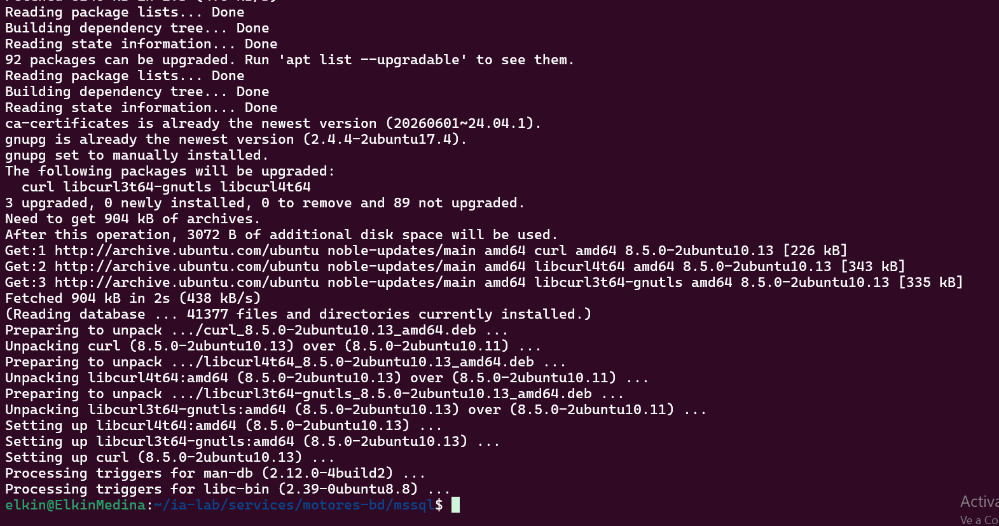
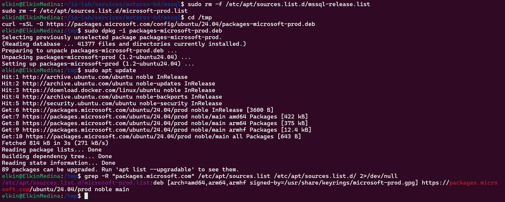
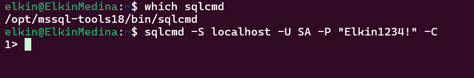

### Instalación de herramientas y verificación de conexión (`sqlcmd`)

Para administrar y conectarme directamente a SQL Server desde la terminal de WSL, instalé las herramientas oficiales `mssql-tools18` y `unixODBC`. Posteriormente, verifiqué el acceso mediante el comando de conexión:

```bash
sqlcmd -S localhost -U SA -P "Elkin1234!" -C
```
**Resultado:**
Instalé con éxito mssql-tools18 en Ubuntu 24.04 y establecí una conexión exitosa al contenedor de SQL Server utilizando el usuario administrador SA y la terminal (sqlcmd), comprobando que el motor de base de datos se encuentra operativo.

## Conectar localmente y Remotamente a el SQL Server 

Me conecto localmente al contenedor de SQL Server utilizando el usuario administrador SA y la contraseña configurada para el proyecto:

```bash
sudo docker exec -it mssql-server /opt/mssql-tools18/bin/sqlcmd -S localhost -U SA -P 'Elkin1234!' -C
```
Una vez dentro de la consola, creé la base de datos principal para el proyecto ActivaFit:

```SQL
CREATE DATABASE ActivaFit;
GO
```
para ver las bases de datos se  usa este comando :

```SQL
SELECT name FROM sys.databases;
GO
```

**creacion del admin**

La base de datos `ActivaFit` ya existe y contiene las tablas del proyecto. Creo el login `admin`, le asigno el rol `sysadmin` y lo habilito para permitir la administración remota. Ejecuto cada comando por separado:

```sql
CREATE LOGIN admin WITH PASSWORD = '1234', CHECK_POLICY = OFF;
```

Después de presionar Enter, escribo manualmente `GO` y presiono Enter.

```sql
ALTER SERVER ROLE sysadmin ADD MEMBER admin;
```

Después de presionar Enter, escribo manualmente `GO` y presiono Enter.

```sql
ALTER LOGIN admin ENABLE;
```

Después de presionar Enter, escribo manualmente `GO` y presiono Enter.
**Evidencia (imagen):**

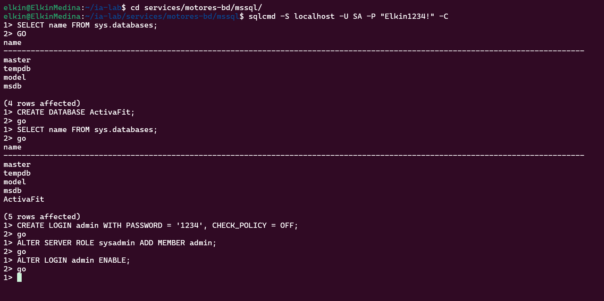

**Resultado:**
Me conecté al contenedor de SQL Server mediante docker exec utilizando las herramientas del sistema y creé la base de datos ActivaFit para estructurar la información del proyecto.

## Conexión a la base de datos mediante DBeaver

Para gestionar de forma gráfica el motor de base de datos y la estructura de **ActivaFit**, configuré una nueva conexión en **DBeaver** utilizando los siguientes parámetros:

* **Servidor:** `172.21.63.86`
* **Puerto:** `1433`
* **Base de datos inicial:** `ActivaFit`
* **usuario:** `Admin`
* **Contraseña:** `1234`

**Evidencia (imagen):**

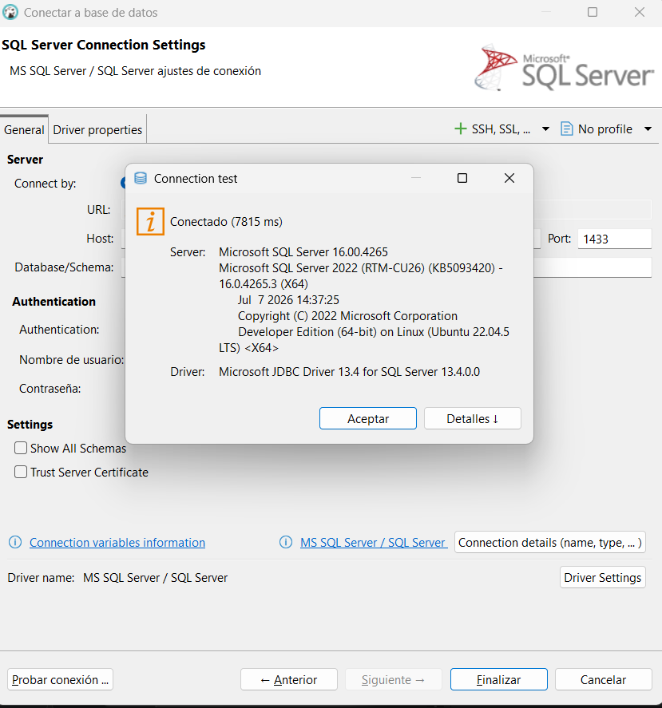
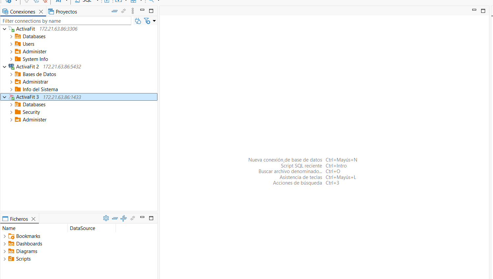


**Resultado:** 
Se verificó y confirmó el éxito de la conexión (`Conectado`) con la instancia de **SQL Server 2022 Developer Edition**, validando el funcionamiento del puerto `1433` y el driver JDBC. Queda listo el entorno gráfico para la gestión completa del proyecto **ActivaFit**.


### Oracle XE

### Crear el archivo `docker-compose.yml` para Oracle


```bash
cat > ~/ia-lab/services/motores-bd/oracle/docker-compose.yml << 'EOF'
services:
  oracle:
    image: gvenzl/oracle-xe:21-slim
    container_name: oracle-server
    restart: unless-stopped

    env_file:
      - .env

    ports:
      - "0.0.0.0:1521:1521"

    volumes:
      - ../../../data/oracle:/opt/oracle/oradata
      - /mnt/d/academia/bd:/backups

    networks:
      - ia-lab-network

    healthcheck:
      test: ["CMD", "healthcheck.sh"]
      interval: 10s
      timeout: 5s
      retries: 10
      start_period: 120s

networks:
  ia-lab-network:
    external: true
EOF
```

**Evidencia (imagen):**

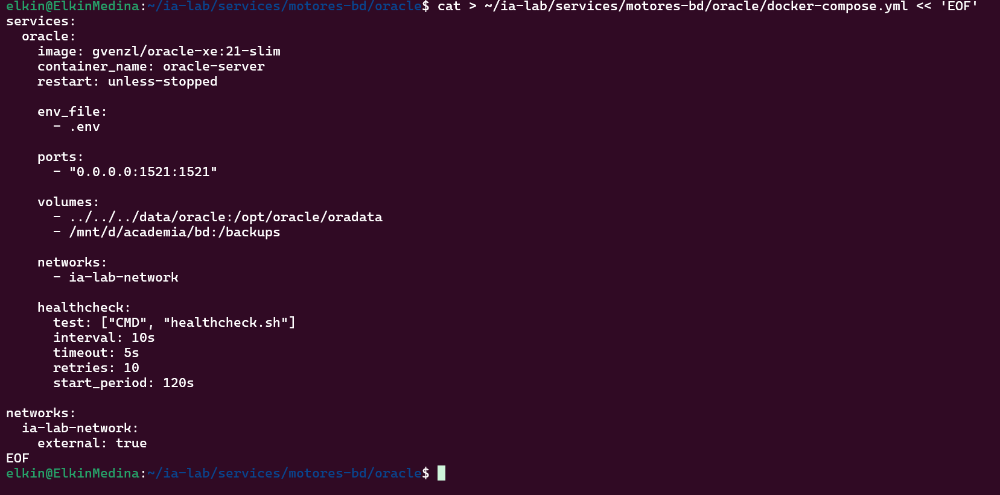

**Resultado:**
Dejé configurado el archivo docker-compose.yml de Oracle con soporte de red externa, variables de entorno y volúmenes de respaldo persistentes, siguiendo exactamente el mismo estándar de arquitectura que los motores anteriores del laboratorio.


### 4.2 Crear el archivo `.env`

Creo el archivo `.env` para configurar la zona horaria, la contraseña de Oracle XE y el nombre del PDB de mi proyecto: `ActivaFit` con la contraseña `1234`.

```bash
cat > ~/ia-lab/services/motores-bd/oracle/.env << 'EOF'
TZ=America/Bogota
ORACLE_PASSWORD=1234
ORACLE_DATABASE=ActivaFit
EOF
```

Para ver lo que guardé dentro del archivo `.env`, ejecuto:

```bash
cat ~/ia-lab/services/motores-bd/oracle/.env
```

**Evidencia (imagen):**

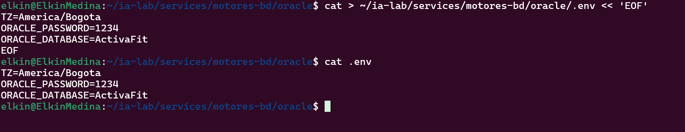


**Resultado:**
Dejé configurado el archivo `docker-compose.yml` de Oracle junto con su respectivo archivo .env con zona horaria America/Bogota, contraseña `1234`, el PDB ActivaFit y el usuario administrador SYSTEM, siguiendo exactamente el mismo estándar de arquitectura que los motores anteriores del laboratorio.

### 4.3 Crear `README.md`

Para mantener documentado cada uno de los servicios de bases de datos dentro de la arquitectura de mi laboratorio, procedí a crear y configurar el archivo `README.md` correspondiente al motor **Oracle**.

Para realizarlo, ejecuté el siguiente procedimiento en la terminal:

```bash
touch ~/ia-lab/services/motores-bd/oracle/README.md
```
Después abro el archivo para agregar su contenido:
```bash

sudo nano ~/ia-lab/services/motores-bd/oracle/README.md
```
Dentro del archivo escribo lo siguiente:
````bash
# Oracle XE - Motor de Base de Datos

> **Acceso remoto habilitado.** Puerto expuesto en `0.0.0.0:1521`.
> **Usuario por defecto:** `SYSTEM`
> **PDB / Service Name:** `ActivaFit`
> **Password:** `1234`

---

## Conectar desde WSL (local)

sudo docker exec -it oracle-server sqlplus 'system/1234@//localhost:1521/ActivaFit'
````

Para comprobar que el archivo se creó correctamente, ejecuto:

```bash
cat ~/ia-lab/services/motores-bd/oracle/README.md
```

**Evidencia (imagen):**

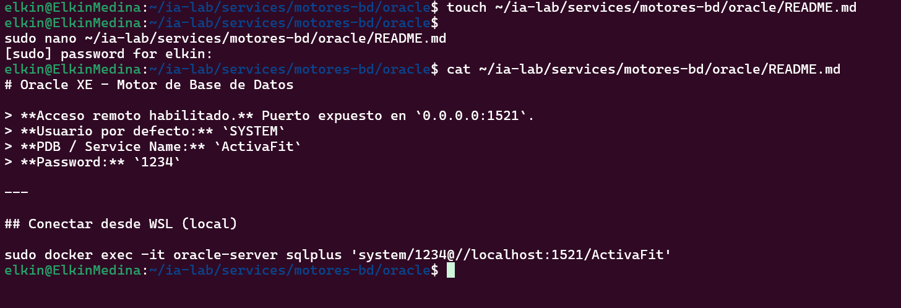

**Resultado:**

Dejé documentado el comando y las credenciales directas para conectarme mediante sqlplus al contenedor oracle-server, permitiéndome validar consultas y el estado de la base de datos de manera ágil desde la terminal.

## Levantar Oracle

Ingreso a la carpeta de Oracle y levanto el contenedor en segundo plano:

```bash
cd ~/ia-lab/services/motores-bd/oracle
sudo docker compose up -d
```

Verifico si el contenedor `oracle-server` está corriendo y reviso sus últimos 30 mensajes:

```bash
sudo docker ps | grep oracle-server
sudo docker logs oracle-server --tail 30
```

**Evidencia (imagen):**

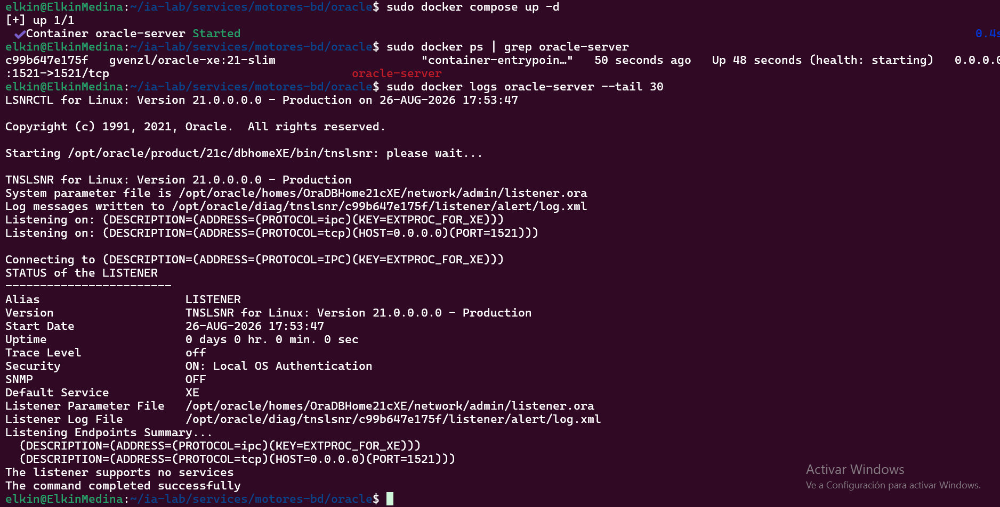

**Resultado:**

Documenté y resolví el error de permisos errno=13 otorgando los permisos correspondientes al volumen persistente de Oracle (data/oracle), asegurando que la imagen gvenzl/oracle-xe:21-slim pueda descomprimir y crear los archivos de base de datos (.dbf, control01.ctl, etc.) sin problemas durante su primer arranque..

#### Revisar y corregir los permisos de los datos

Primero reviso los permisos y el contenido de la carpeta de datos:

```bash
ls -ld ~/ia-lab/data/oracle
sudo ls -la ~/ia-lab/data/oracle
```

```bash
sudo docker compose down
```

Cambio el propietario de la carpeta al usuario y grupo utilizados por Oracle dentro del contenedor:

```bash
sudo chown -R 54321:54321 ~/ia-lab/data/oracle
```

Después otorgo permisos de lectura y escritura:

```bash
sudo chmod -R 775 ~/ia-lab/data/oracle
```

Vuelvo a iniciar Oracle:

```bash
sudo docker compose up -d
```


#### 4.4.2 Verificar el inicio de Oracle

Compruebo nuevamente el estado del contenedor y el puerto publicado:

```bash
sudo docker ps | grep oracle-server
```

El resultado esperado es similar a:

```text
oracle-server   Up 10 seconds (health: starting)   0.0.0.0:1521->1521/tcp
```

También reviso los últimos 30 mensajes para comprobar el listener:

```bash
sudo docker logs oracle-server --tail 30
```

En los registros busco el mensaje:

```text
Listening on: (DESCRIPTION=(ADDRESS=(PROTOCOL=tcp)(HOST=0.0.0.0)(PORT=1521)))
```

Este mensaje confirma que el listener de Oracle está escuchando en el puerto `1521` y que el contenedor ya está terminando su inicialización.

**Evidencia de la solución (imagen):**

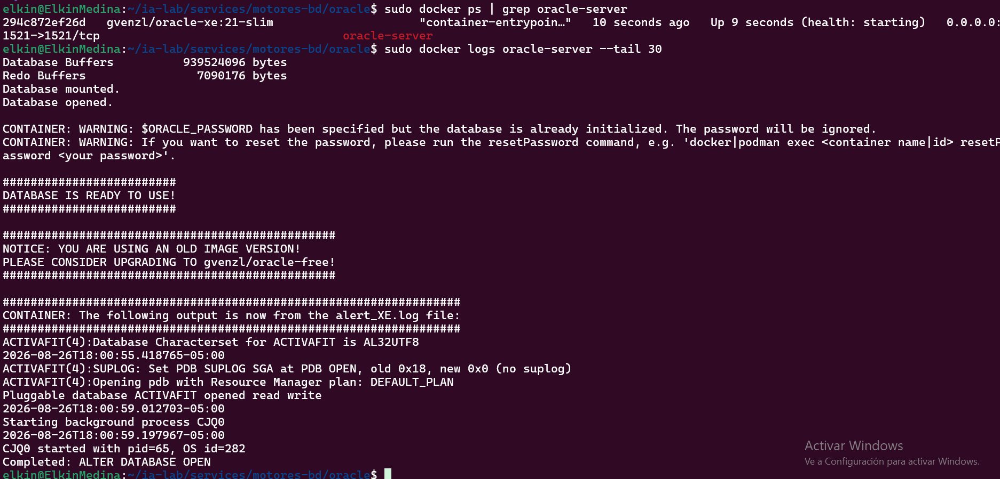

**Resultado:**

Documenté el arranque exitoso de Oracle XE, confirmando que la base de datos ACTIVAFIT ya se encuentra montada, abierta y preparada para recibir las consultas y conexiones desde el laboratorio..

## Conectar localmente a Oracle

Ingreso al contenedor de Oracle XE:

```bash
sudo docker exec -it oracle-server bash
```

Me conecto a Oracle utilizando el usuario administrador `SYSTEM`, la contraseña `1234` y el PDB `ActivaFit`:

```bash
sqlplus 'system/1234@//localhost:1521/ActivaFit'
```

Debo esperar a que aparezca el indicador `SQL>` antes de escribir comandos de Oracle. Entrar al contenedor solo muestra el aviso `bash-4.4$`; en ese punto todavía estoy en Bash y no en SQL*Plus.

Si escribo comandos como `SELECT`, `CONN`, `DESC` o `EXIT` mientras aparece `bash-4.4$`, Bash intenta interpretarlos como comandos de Linux y muestra un error. Para ejecutar esos comandos debo estar dentro de SQL*Plus, donde el aviso es `SQL>`.

Ya dentro del motor, creo el usuario `admin`, que utilizaré como esquema del proyecto `ActivaFit`:

```sql
CREATE USER admin IDENTIFIED BY "1234" DEFAULT TABLESPACE USERS QUOTA UNLIMITED ON USERS;
ALTER USER admin QUOTA UNLIMITED ON USERS;
GRANT CONNECT, RESOURCE TO admin;
```
**Salir del motor**

```sql
EXIT;
```
**Evidencia (imagen):**

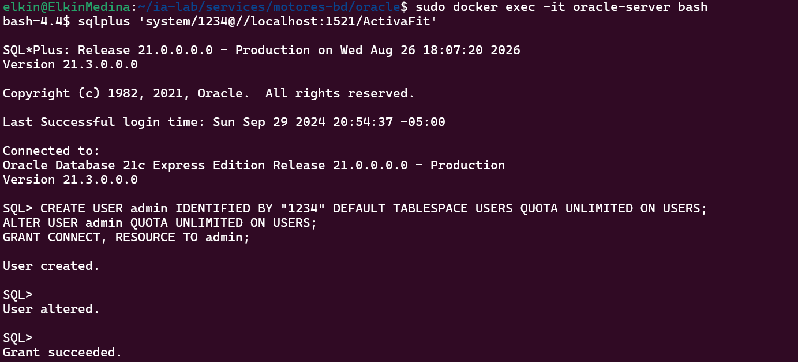

**Resultado:**

Documenté el proceso completo de acceso por consola mediante sqlplus y la creación exitosa del usuario admin con sus respectivos privilegios y cuotas de espacio habilitadas en el tablespace por defecto, dejando la base de datos lista para estructurar el modelo relacional.


## Crear un usuario propio con acceso remoto

Para crear y administrar mi usuario propio, primero me conecto como `SYSTEM` al PDB `ActivaFit`:


Para hacerlo nuevamente, ejecuto los comandos paso a paso y espero el indicador correspondiente antes de continuar:

**Paso 1. Entro al contenedor:**

```bash
sudo docker exec -it oracle-server bash
```

Debo comprobar que aparezca `bash-4.4$`.

**Paso 2. Inicio SQL*Plus como `SYSTEM`:**

```bash
sqlplus 'system/1234@//localhost:1521/ActivaFit'
```

Espero a que aparezca `SQL>`. Los siguientes comandos solo se ejecutan después de ver ese indicador.

**Paso 3. Me conecto al usuario `admin`:**

```sql
CONN admin/1234@//localhost:1521/ActivaFit
```

**Paso 4. Consulto los usuarios o esquemas:**

```sql
SELECT username FROM all_users ORDER BY username;
```
**Evidencia (imagen):**

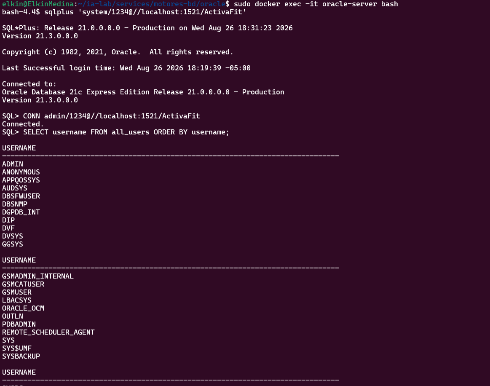


**Resultado:**

Documenté la conexión exitosa al esquema admin en Oracle XE, estableciendo el entorno de trabajo adecuado para la construcción y verificación de las tablas de la base de datos del laboratorio.


## Conectar remotamente desde cualquier equipo

##### **Hacerlo desde DBeaver**

Para conectarme remotamente a Oracle XE utilizo DBeaver. Primero consulto la dirección IP del equipo donde está ejecutándose Docker:

```bash
ip a
```

En el resultado busco la interfaz `eth0`. En mi caso, utilizo la dirección IP `172.21.63.86` como **Host**.

También verifico que el contenedor esté activo y que el puerto `1521` esté publicado:

```bash
  sudo docker ps --filter "name=oracle-server" --format "table {{.Names}}\t{{.Ports}}"
```


**Evidencia (imagen):**

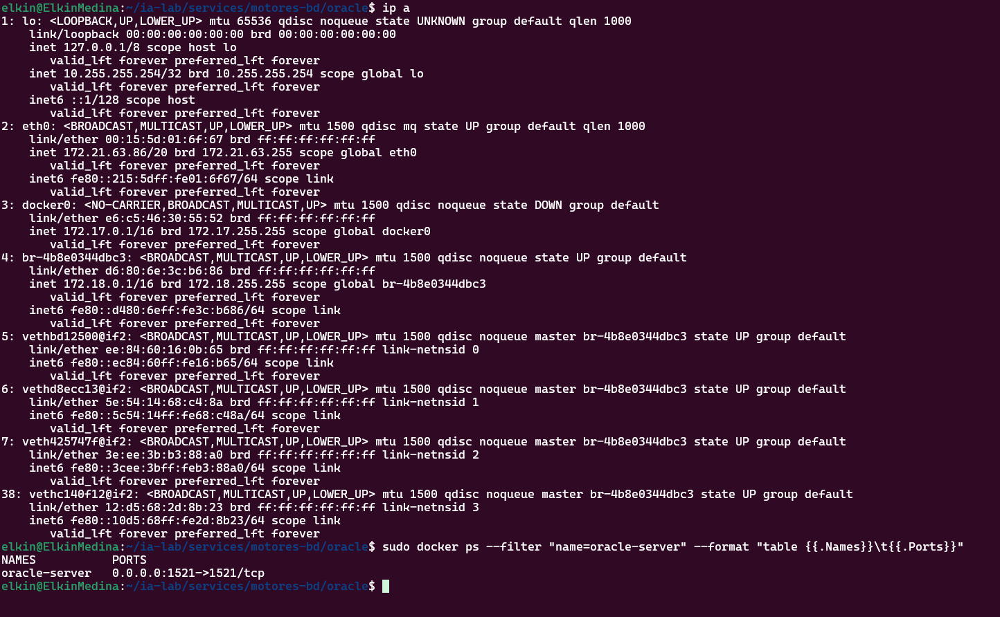

**Resultado:**

Consulté la configuración de red con `ip a` y comprobé que la interfaz `eth0` tiene la dirección IP `172.21.63.86`. También verifiqué que el contenedor `oracle-server` está activo y publica el puerto `1521` mediante `0.0.0.0:1521->1521/tcp`.

En DBeaver realizo los siguientes pasos:

1. Abro DBeaver.
2. Selecciono **Nueva conexión**.
3. Elijo el controlador **Oracle**.

En la pestaña **Basic** dejo la conexión con estos valores:

4. Escribo `172.21.63.86` en **Host**.
5. Escribo `1521` en **Port**.
6. En el campo **Database**, escribo `ActivaFit`.
7. En el selector que aparece a la derecha de **Database**, selecciono **Service Name**.
8. Escribo `admin` en **Nombre de usuario**.
9. Escribo `1234` en **Contraseña**.
10. En **Role**, selecciono **Normal**.
11. Dejo **Authentication** en **Username/password**.
12. Dejo **Local Client** en `<not present>`.
13. Presiono **Probar conexión...**.
14. Si la prueba es correcta, presiono **Finalizar** para guardar la conexión.


**Evidencia (imágenes):**

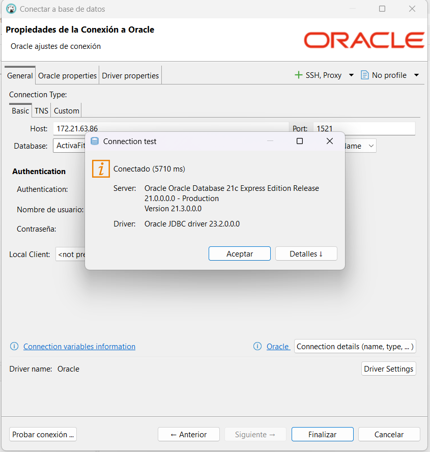

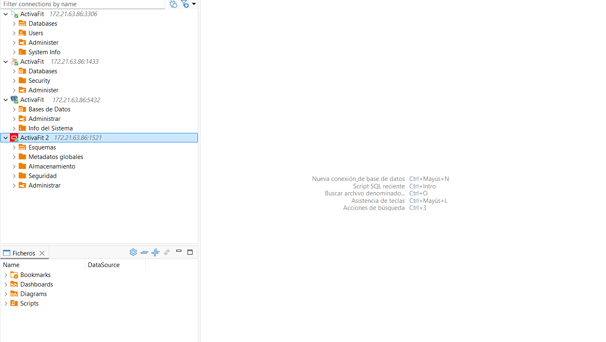


### respaldo (Backup) de todos los motores 

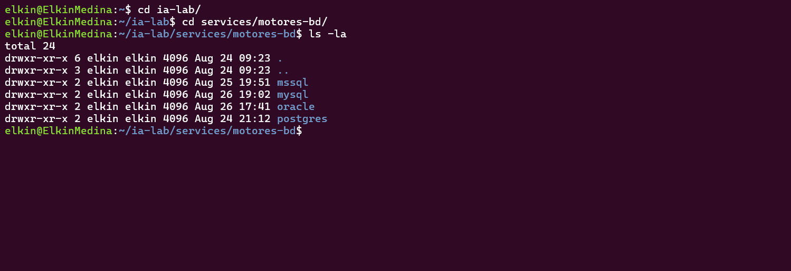


# Conclusión

En este laboratorio has desplegado, configurado y respaldado con éxito los principales motores de bases de datos para tu proyecto ActivaFit utilizando contenedores Docker. Con MSSQL y Oracle Database, automatizaste respaldos robustos (archivos .bak y .dmp) y gestionaste su extracción hacia volúmenes persistentes en el host, complementándolo con servicios como PostgreSQL y MySQL. En resumen, dominaste la contenerización, el mapeo de directorios en WSL y las estrategias de respaldo para garantizar la seguridad, resiliencia y portabilidad de tus datos a nivel de ingeniería


Presentado por : 

**ELKIN ZAITH MEDINA MARTINEZ**  
Estudiante de Ingeniería de Sistemas   
Universidad de La Guajira  
**Docente**:Ing. Jaider Quintero M.  

