# CONSULTAS AVANZANDAS SQL

## Imagenes de los registros de cada tabla creada :


## 1. Consultas avanzadas en MySQL :

#### 1.1 Mostrar algunos de los registros de la tabla clients

``` sql
SELECT name,document_type, document_number, status FROM clients;
```

## 

### 1.2 Mostrar de forma ordenada (DESC) las membresias desde su comienzo

``` sql
SELECT id, start_date, end_date, status FROM memberships   ORDER BY start_date DESC;
```


### 1.3 Consultas a múltiples tablas mediante WHERE

``` sql
SELECT *
FROM memberships m ,clients c 
WHERE c.id = m.client_id;
```


### 1.4 Consultas a múltiples tablas mediante JOIN

``` sql
SELECT C.name, C.email, M.* 
FROM clients as C 
join memberships as M on( C.id = M.client_id ); 
```


### 1.5 Condiciones en las Consultas o filtros en las Consultas

Para las condiciones se utiliza la clausula Where de la siguiente manera:

Quiero realizar la misma consulta anterior de cualquiera de las dos formas, teniendo en cuenta la condición que presente las ventas de una status especifica.

``` sql
SELECT *
FROM memberships m ,clients c 
WHERE c.id = m.client_id and m.status ="active";
```


``` sql
SELECT C.name, C.email, M.* 
FROM clients as C 
join memberships as M on( C.id = M.client_id ) 
where  M.status = "expired"; 
```


### 1.6 Consultas con filtros condicional LIKE

``` sql
select * 
from clients as C 
where C.email like 'm%';
```

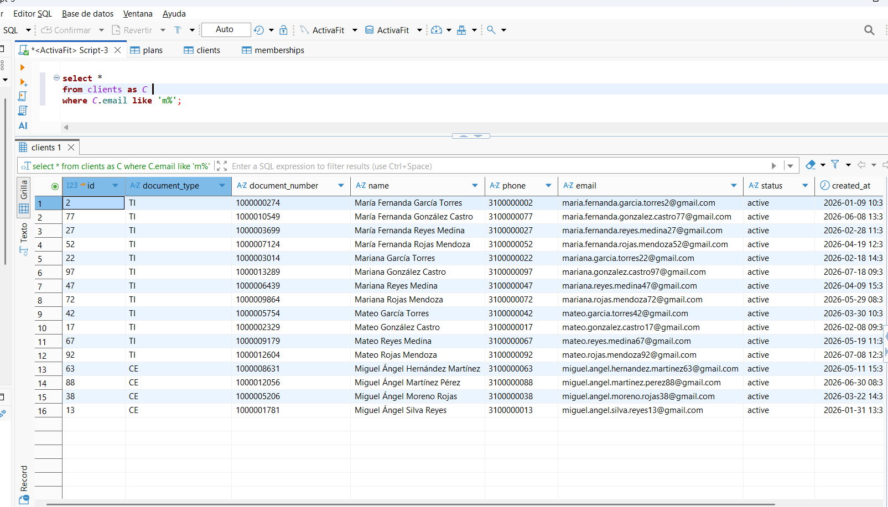

**Mostrar todos los correos de los clientes que contengan el dominio gmail**

``` sql
SELECT * 
FROM clients as C 
where C.email like concat('%','gmail','%'); 
```

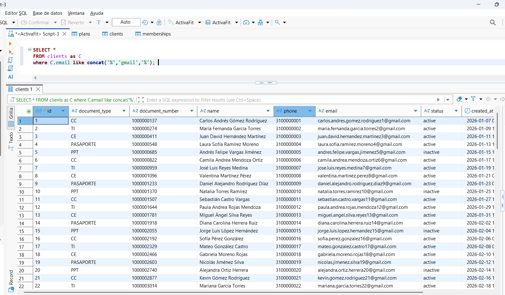

**combinacion del punto 1.5 y la implementacion de el like**

``` sql
SELECT C.name, C.email, M.* 
FROM clients as C 
join memberships as M on( C.id = M.client_id ) 
where  M.status = "expired" and C.email like 'm%'; 
```

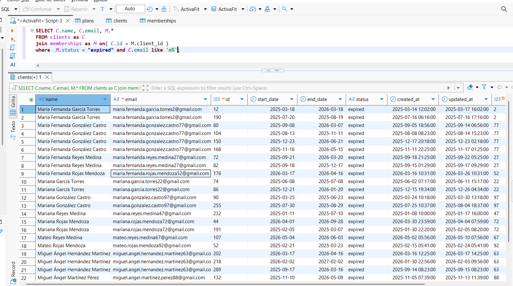

### 1.7 Consultas con filtros condicionales BETWEEN

``` sql
SELECT C.name, C.email, M.start_date ,M.status , PAY.payment_date , PL.name 
FROM clients C
JOIN memberships M ON C.id = M.client_id
JOIN payments PAY ON M.id = PAY.membership_id
JOIN plans PL ON PL.id = M.plan_id
WHERE PAY.payment_date BETWEEN '2025-01-15 12:26:02' AND '2026-04-21 13:51:24'
ORDER BY PAY.payment_date ASC;
```

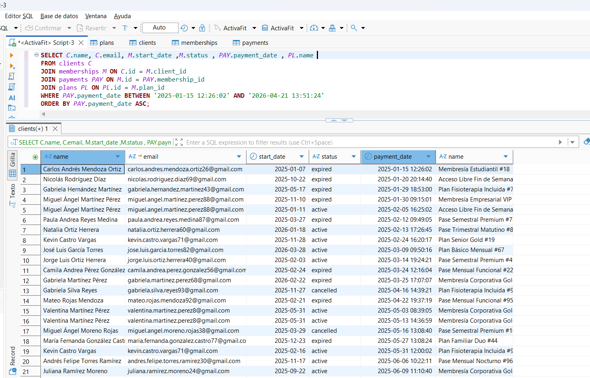 **Forma 2:**

``` sql
SELECT C.name, C.email, M.start_date ,M.status , PAY.payment_date , PL.name 
FROM clients C, memberships M, payments PAY, plans PL
WHERE C.id = M.client_id
  AND M.id = PAY.membership_id
  AND PL.id = M.plan_id
  AND M.start_date  BETWEEN '2025-01-01' AND '2026-03-30'
ORDER BY PAY.payment_date ASC;
```

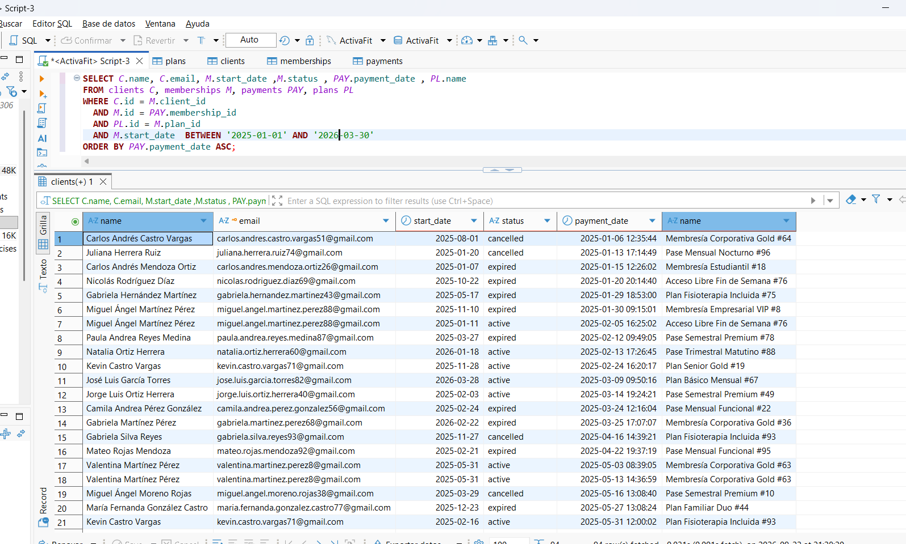

### 1.8 Consultas con agrupamiento GROUP BY 

Se consideran este tipo de consultas cuando tenemos valores que se repiten en los registros.

Si observamos la siguiente consulta:

**Forma 1 con el where:**

``` sql
SELECT  C.id,  C.name,  SUM(P.amount) AS TotalSuma, 
    COUNT(P.id) AS CuentaTotal, 
    AVG(P.amount) AS Promedio  
FROM clients AS C
JOIN memberships AS M ON C.id = M.client_id
JOIN payments AS P ON M.id = P.membership_id
WHERE P.payment_date BETWEEN '2025-03-01 00:00:00' AND '2026-03-30 23:59:59'
GROUP BY C.id, C.name
ORDER BY TotalSuma DESC;
```

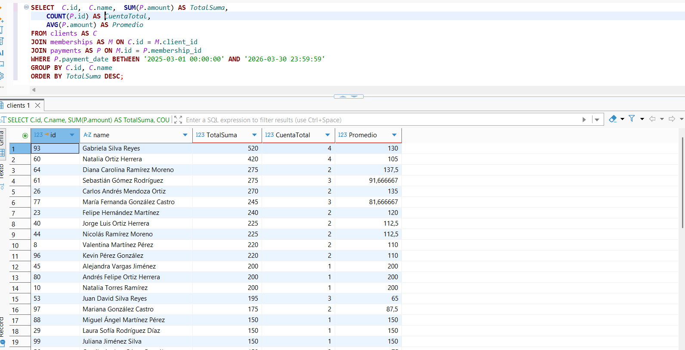

**Forma 1:**

``` sql
SELECT C.id,  C.name,  SUM(P.amount) AS TotalGasto, 
    COUNT(P.id) AS CantidadPagos
FROM clients AS C
JOIN memberships AS M ON C.id = M.client_id
JOIN payments AS P ON M.id = P.membership_id
WHERE P.status = 'pagado' AND P.method = 'tarjeta'
GROUP BY C.id, C.name
ORDER BY TotalGasto DESC;
```

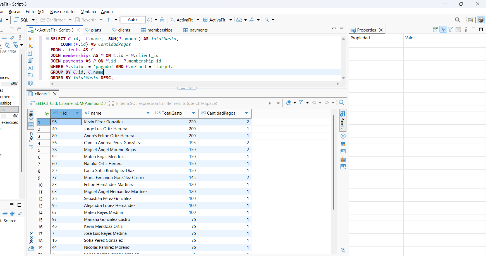

**forma 2 con el having:**

``` sql
SELECT C.id, C.name, SUM(P.amount) AS TotalSuma, 
AVG(P.amount) AS PromedioPago
FROM clients AS C
JOIN memberships AS M ON C.id = M.client_id
JOIN payments AS P ON M.id = P.membership_id 
GROUP BY C.id, C.name HAVING SUM(P.amount) >= 100 
ORDER BY TotalSuma DESC;
```

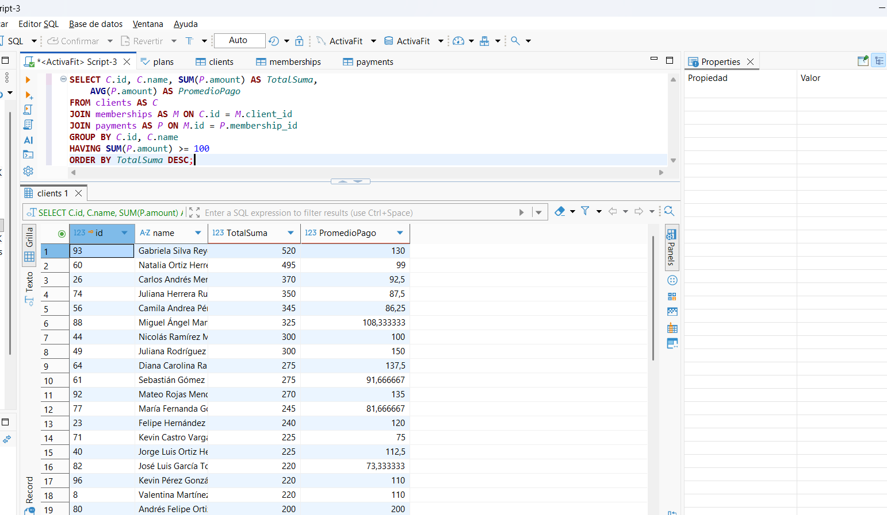

``` sql
SELECT C.id, C.name, C.email,  SUM(P.amount) AS TotalAnual,   
COUNT(P.id) AS TotalPagos 
FROM clients AS C 
JOIN memberships AS M ON C.id = M.client_id
JOIN payments AS P ON M.id = P.membership_id
WHERE P.payment_date BETWEEN '2025-01-01 00:00:00' AND '2026-12-31 23:59:59' 
GROUP BY C.id, C.name, C.email 
HAVING COUNT(P.id) >= 3 AND SUM(P.amount) > 100 
ORDER BY TotalAnual DESC;
```

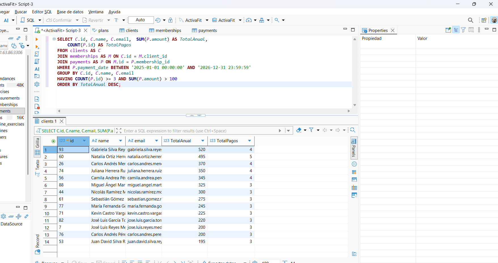

### 1.9 Subconsultas y teoría de conjuntos

En las Sub Consultas podemos realizar la teoría de conjuntos aplicadas a las bases de datos:

la mas conocida es el siguiente caso:

Teniendo en cuenta las tablas entre clientes y membresias, muestre los clientes que no le han realizado membresias en una fecha de inicion.

``` sql
SELECT  * 
FROM m clients as C 
WHERE  C.id Not In(select M.client_id from memberships as M where M.start_date 
BETWEEN  "2025-03-01" and "2026-03-30"); 
```

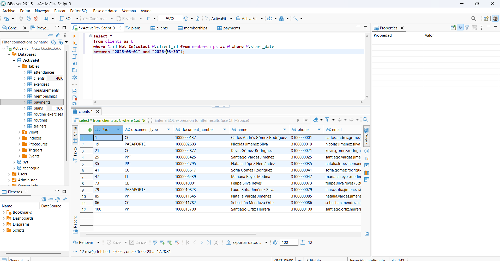

**Forma 2:**

``` sql
select * 
from clients as C 
left join memberships  as M on(C.id = M.client_id and M.start_date 
between "2025-03-01" and "2026-03-30") 
where  M.client_id is null;
```

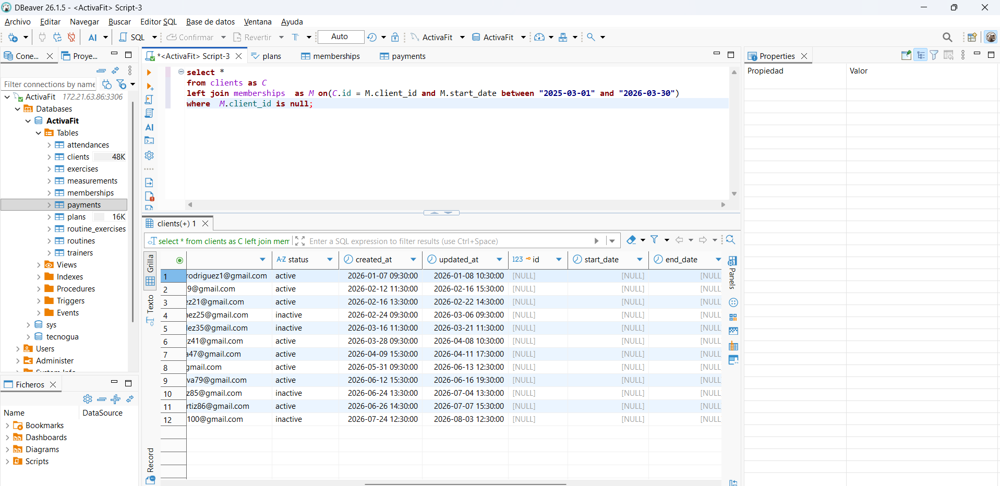

## 2. Consultas avanzadas en PostgreSQL :

#### 2.1 Mostrar algunos de los registros de la tabla clients

``` sql
SELECT name,document_type, document_number, status FROM clients;
```

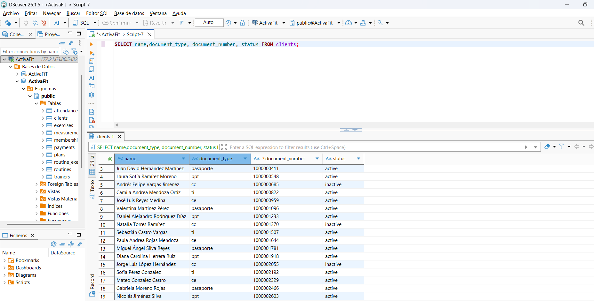

### 2.2 Mostrar de forma ordenada (DESC) las payments desde su comienzo

``` sql
SELECT id,method,amount,status FROM payments  ORDER BY payment_date DESC;
```

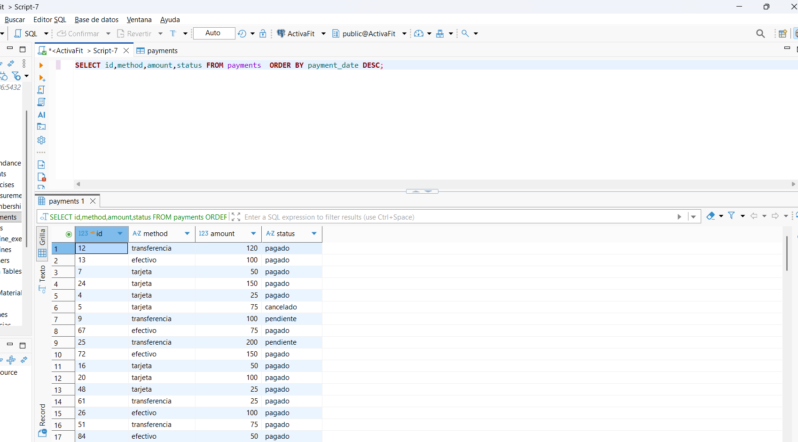

### 

### 2.3 Consultas a múltiples tablas mediante WHERE

``` sql
SELECT m.start_date ,m.end_date ,m.status ,pay.payment_date ,pay.status 
FROM  memberships m ,payments pay  
WHERE m.id = pay.membership_id;
```

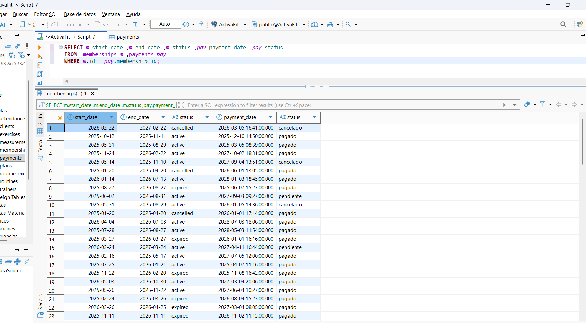

### 2.4 Consultas a múltiples tablas mediante JOIN

``` sql
SELECT C.name, C.email, M.*  
FROM clients as C  
join memberships as M on( C.id = M.client_id ); 
```

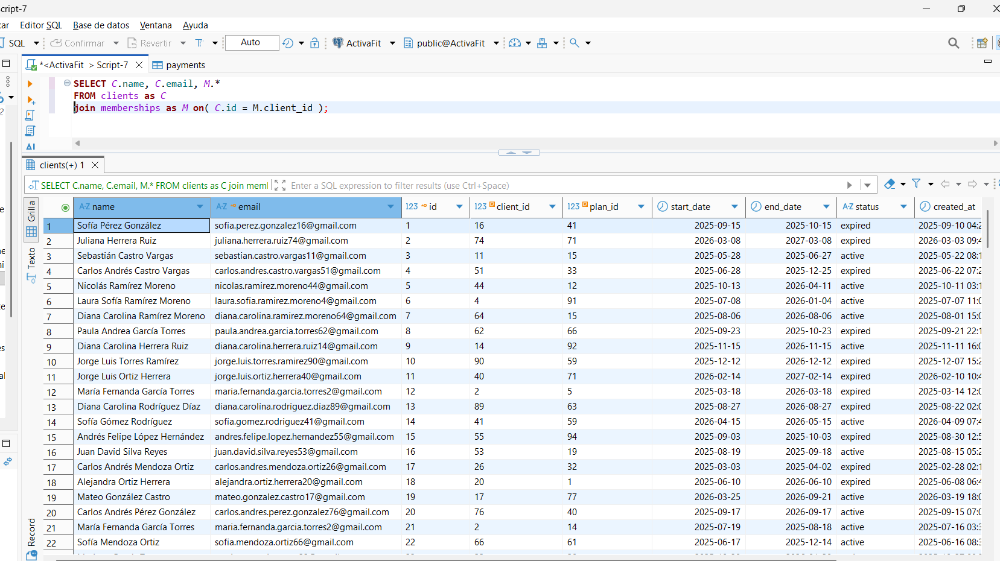

### 2.5 Condiciones en las Consultas o filtros en las Consultas

Para las condiciones se utiliza la clausula Where de la siguiente manera:

Quiero realizar la misma consulta anterior de cualquiera de las dos formas, teniendo en cuenta la condición que presente las ventas de una status especifica.

``` sql
SELECT * FROM memberships m ,clients c  WHERE c.id = m.client_id and m.status ="active";
```

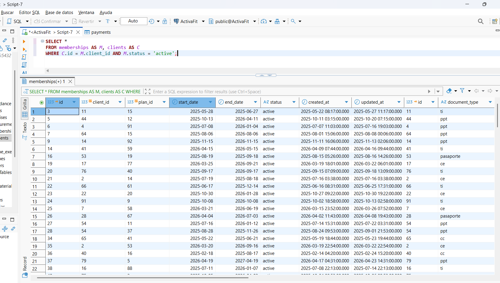

**Forma 2 :**

``` sql
SELECT C.name, C.email,M.start_date ,M.client_id, M.status  
FROM clients as C  
join memberships as M on( C.id = M.client_id )  
where  M.status = 'expired'; 
```

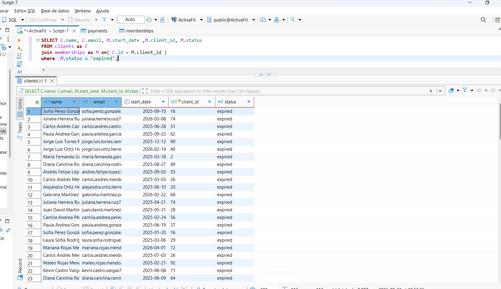

### 2.6 Consultas con filtros condicional LIKE

``` sql
select *  from clients as C  where C.email like 'm%';
```

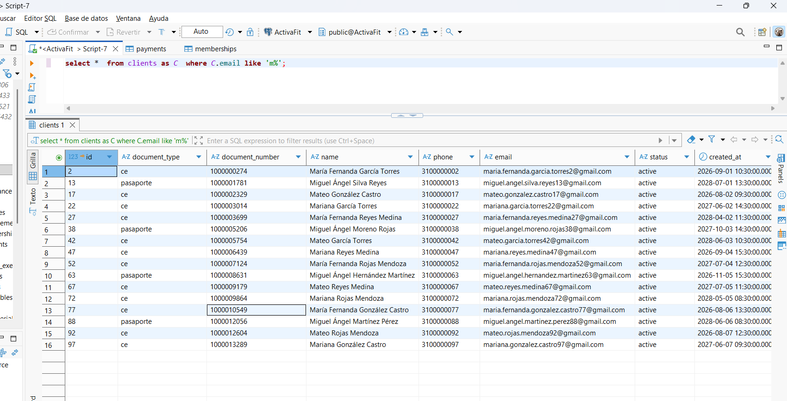

**Mostrar todos los correos de los clientes que contengan el dominio gmail**

``` sql
SELECT *  FROM clients as C  where C.email like concat('%','gmail','%'); 
```

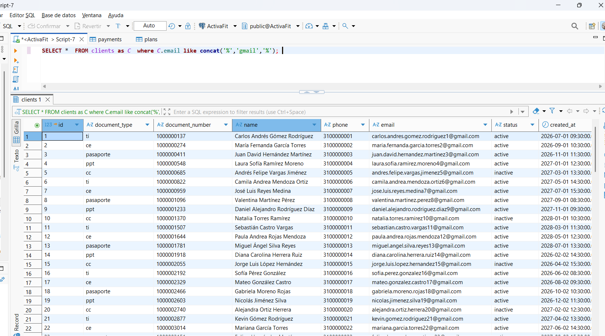

**combinacion del punto 1.5 y la implementacion de el like**

``` sql
SELECT C.name, C.email, M.start_date ,M.status  
FROM clients as C  
join memberships as M on( C.id = M.client_id ) 
where  M.status = 'expired' and C.email like 'm%'; 
```

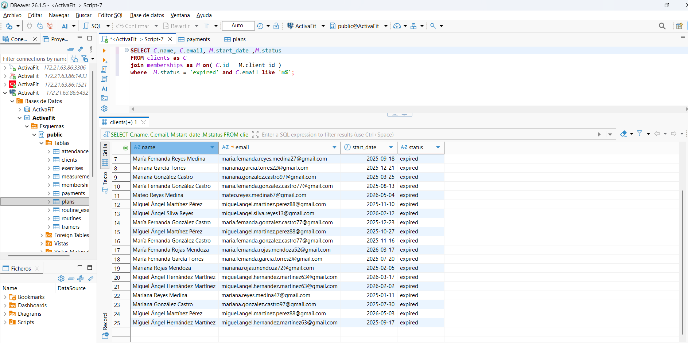

### 2.7 Consultas con filtros condicionales BETWEEN

``` sql
SELECT C.name, C.email, M.start_date ,M.status , PAY.payment_date , PL.name  FROM clients C JOIN memberships M ON C.id = M.client_id JOIN payments PAY ON M.id = PAY.membership_id JOIN plans PL ON PL.id = M.plan_id WHERE PAY.payment_date BETWEEN '2025-01-15 12:26:02' AND '2026-04-21 13:51:24' ORDER BY PAY.payment_date ASC;
```

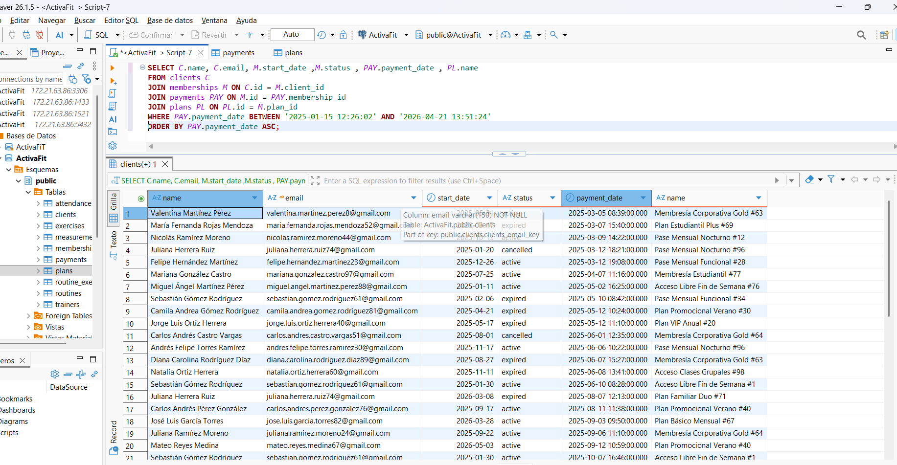

**Forma 2:**

``` sql
SELECT C.name, C.email, M.start_date ,M.status , PAY.payment_date , PL.name  FROM clients C, memberships M, payments PAY, plans PL WHERE C.id = M.client_id   AND M.id = PAY.membership_id   AND PL.id = M.plan_id   AND M.start_date  BETWEEN '2025-01-01' AND '2026-03-30' ORDER BY PAY.payment_date ASC;
```

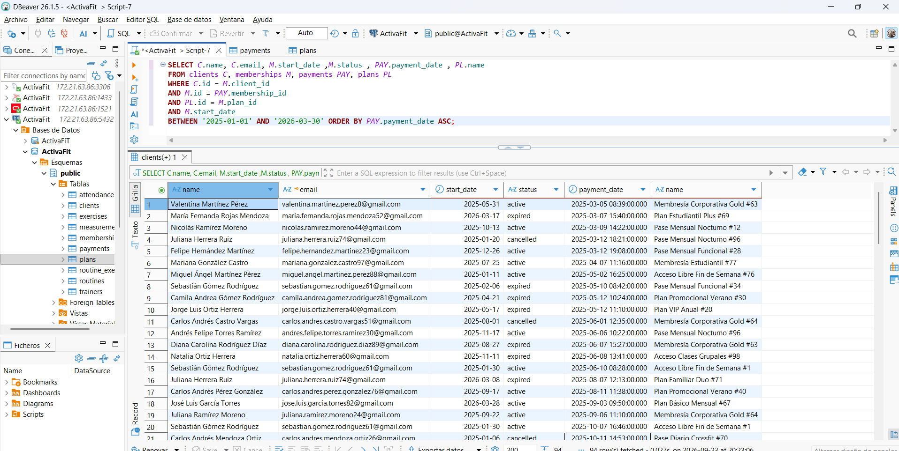

### 2.8 Consultas con agrupamiento GROUP BY 

Se consideran este tipo de consultas cuando tenemos valores que se repiten en los registros.

Si observamos la siguiente consulta:

**Forma 1 con el where:**

``` sql
SELECT  C.id,  C.name,  SUM(P.amount) AS TotalSuma,      COUNT(P.id) AS CuentaTotal,      AVG(P.amount) AS Promedio   FROM clients AS C JOIN memberships AS M ON C.id = M.client_id JOIN payments AS P ON M.id = P.membership_id WHERE P.payment_date BETWEEN '2025-03-01 00:00:00' AND '2026-03-30 23:59:59' GROUP BY C.id, C.name ORDER BY TotalSuma DESC;
```

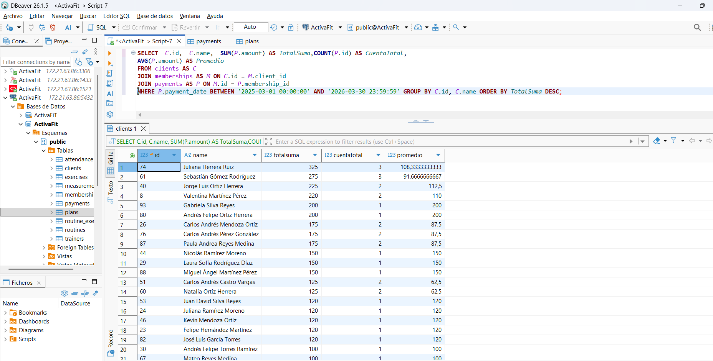

**Forma 1:**

``` sql
SELECT C.id,  C.name,  SUM(P.amount) AS TotalGasto,      COUNT(P.id) AS CantidadPagos FROM clients AS C JOIN memberships AS M ON C.id = M.client_id JOIN payments AS P ON M.id = P.membership_id WHERE P.status = 'pagado' AND P.method = 'tarjeta' GROUP BY C.id, C.name ORDER BY TotalGasto DESC;
```

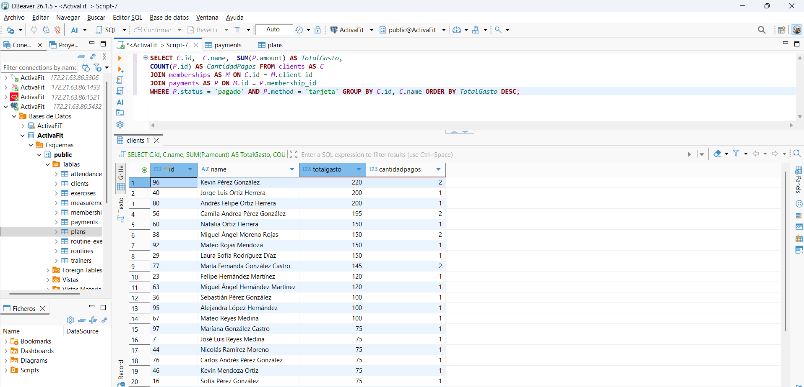

**forma 2 con el having:**

``` sql
SELECT C.id, C.name, SUM(P.amount) AS TotalSuma,  AVG(P.amount) AS PromedioPago FROM clients AS C JOIN memberships AS M ON C.id = M.client_id JOIN payments AS P ON M.id = P.membership_id  GROUP BY C.id, C.name HAVING SUM(P.amount) >= 100  ORDER BY TotalSuma DESC;
```

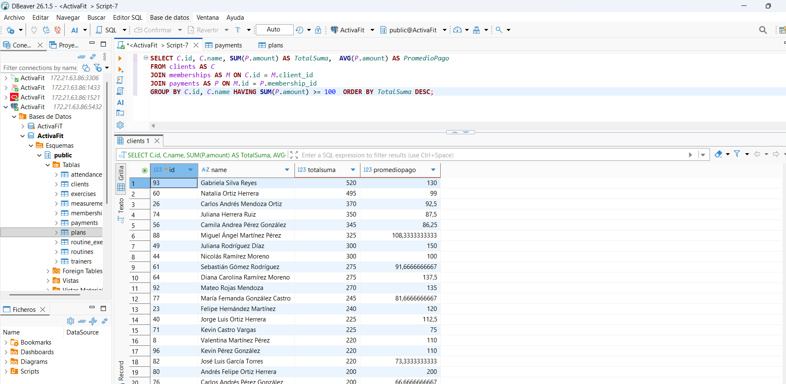

``` sql
SELECT C.id, C.name, C.email,  SUM(P.amount) AS TotalAnual,    COUNT(P.id) AS TotalPagos  FROM clients AS C  JOIN memberships AS M ON C.id = M.client_id JOIN payments AS P ON M.id = P.membership_id WHERE P.payment_date BETWEEN '2025-01-01 00:00:00' AND '2026-12-31 23:59:59'  GROUP BY C.id, C.name, C.email  HAVING COUNT(P.id) >= 3 AND SUM(P.amount) > 100  ORDER BY TotalAnual DESC;
```

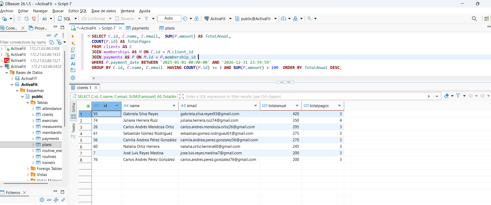

### 2.9 Subconsultas y teoría de conjuntos

En las Sub Consultas podemos realizar la teoría de conjuntos aplicadas a las bases de datos:

la mas conocida es el siguiente caso:

Teniendo en cuenta las tablas entre clientes y membresias, muestre los clientes que no le han realizado membresias en una fecha de inicion.

``` sql
SELECT  *  FROM m clients as C  WHERE  C.id Not In(select M.client_id from memberships as M where M.start_date  BETWEEN  '2025-03-01' and '2026-03-30'); 
```

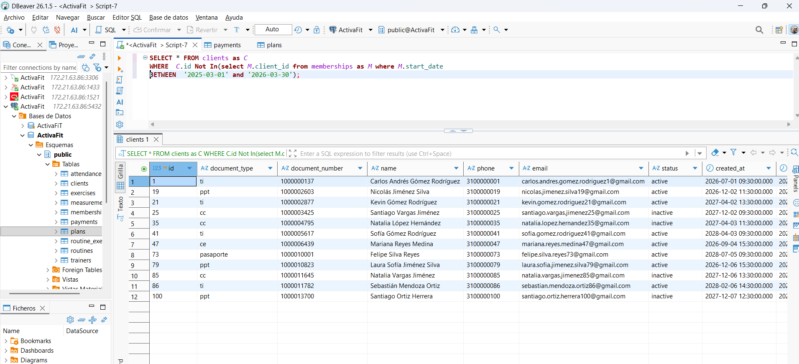

**Forma 2:**

``` sql
select *  from clients as C  left join memberships  as M on(C.id = M.client_id and M.start_date  between '2025-03-01' and '2026-03-30')  where  M.client_id is null;
```

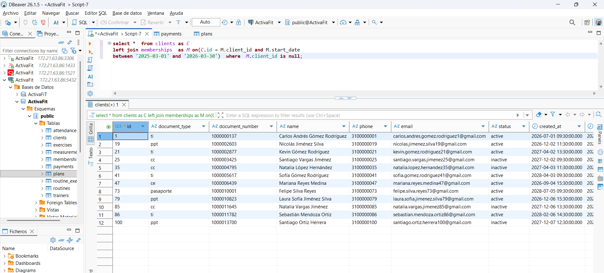

## 3. Consultas avanzadas en MSSQL :

#### 3.1 Mostrar algunos de los registros de la tabla exercises

``` sql
SELECT name,description, status FROM exercises;
```

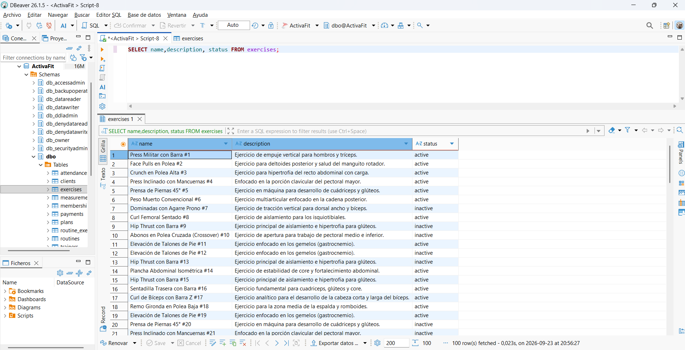

### 3.2 Mostrar de forma ordenada (DESC) las payments desde su comienzo

``` sql
SELECT id,method,amount,status FROM payments  ORDER BY payment_date DESC;
```

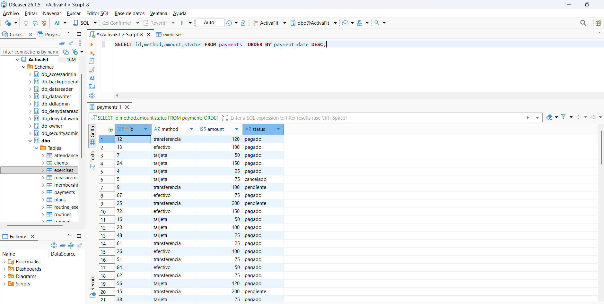

### 3.3 Consultas a múltiples tablas mediante WHERE

``` sql
SELECT m.start_date ,m.end_date ,m.status ,pay.payment_date ,pay.status  FROM  memberships m ,payments pay   WHERE m.id = pay.membership_id;
```

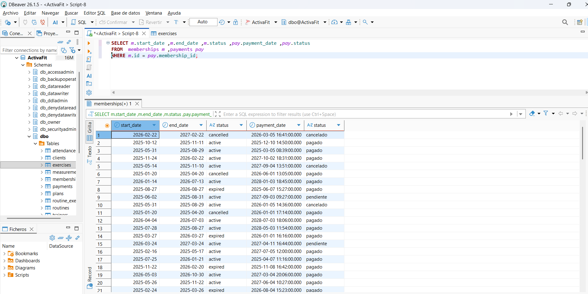

### 3.4 Consultas a múltiples tablas mediante JOIN

``` sql
SELECT C.name, C.email, M.*   FROM clients as C   join memberships as M on( C.id = M.client_id ); 
```

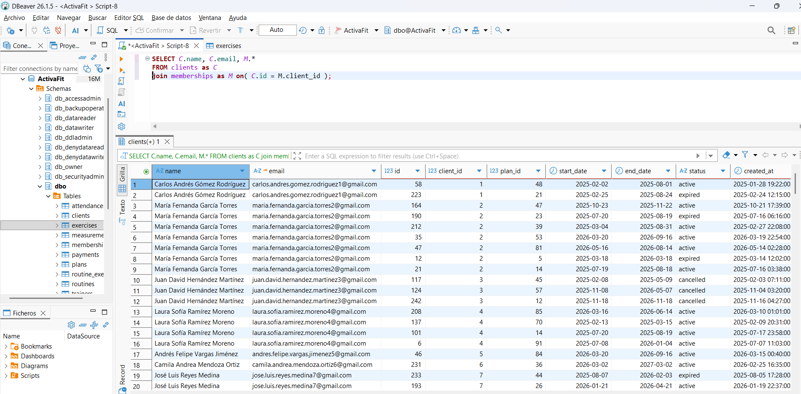

### 3.5 Condiciones en las Consultas o filtros en las Consultas

Para las condiciones se utiliza la clausula Where de la siguiente manera:

Quiero realizar la misma consulta anterior de cualquiera de las dos formas, teniendo en cuenta la condición que presente las ventas de una status especifica.

``` sql
SELECT * FROM memberships m ,clients c  WHERE c.id = m.client_id and m.status ='active';
```

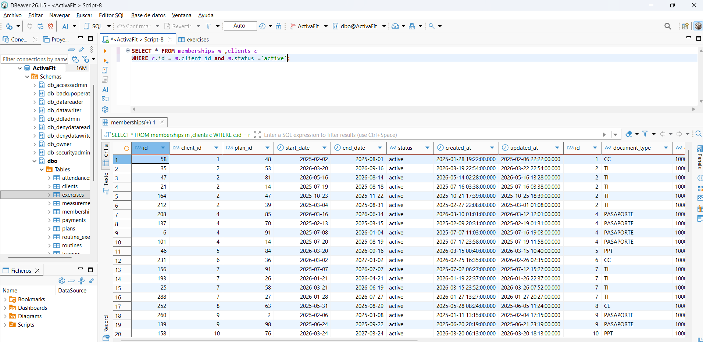

**Forma 2 :**

``` sql
SELECT C.name, C.email,M.start_date ,M.client_id, M.status   FROM clients as C   join memberships as M on( C.id = M.client_id )   where  M.status = 'expired'; 
```

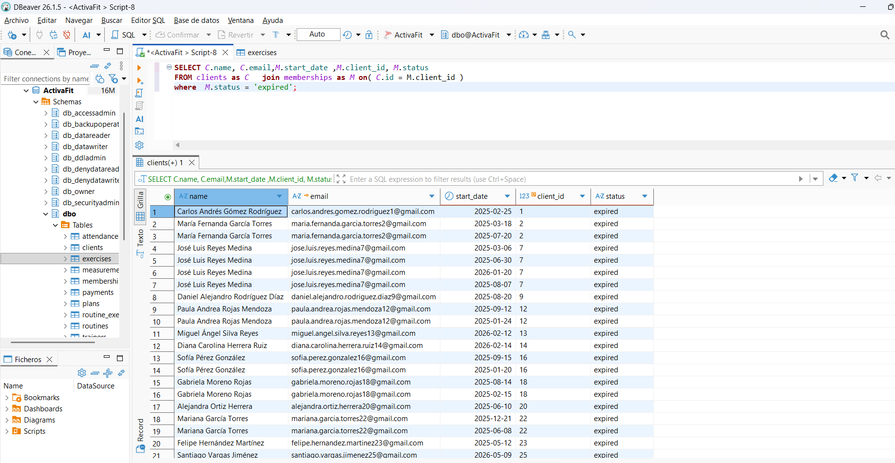

### 3.6 Consultas con filtros condicional LIKE

``` sql
select *  from clients as C  where C.email like 'm%';
```

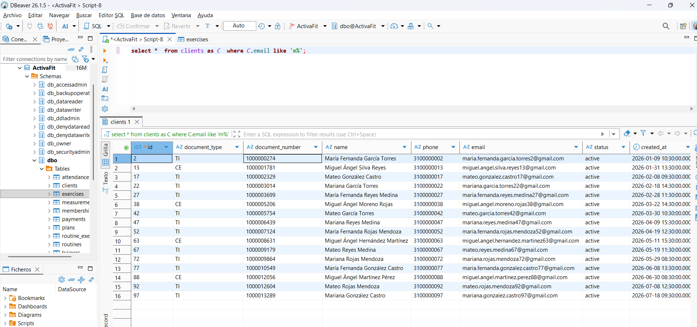

**Mostrar todos los correos de los clientes que contengan el dominio gmail**

``` sql
SELECT id,document_type ,document_number , name,email  
FROM clients as C  where C.email like concat('%','gmail','%'); 
```

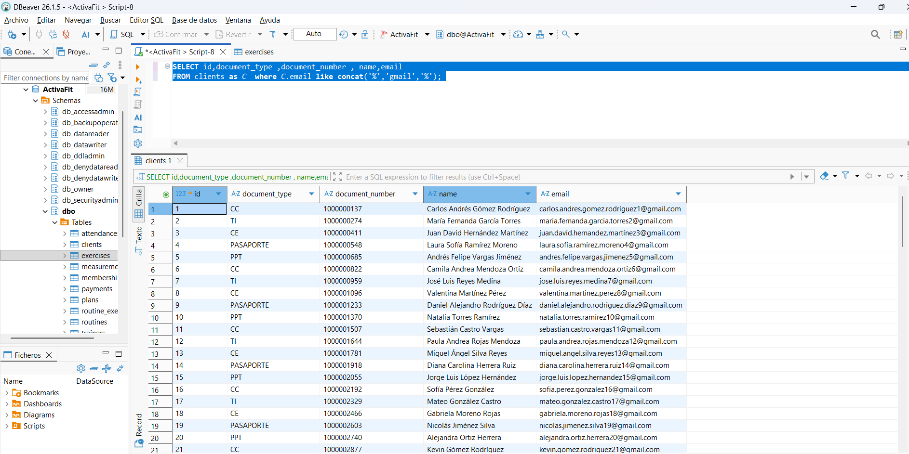

**combinacion del punto anterior y la implementacion de el like**

``` sql
SELECT C.name, C.email, M.start_date ,M.status   FROM clients as C   join memberships as M on( C.id = M.client_id )  where  M.status = 'expired' and C.email like 'm%'; 
```

### 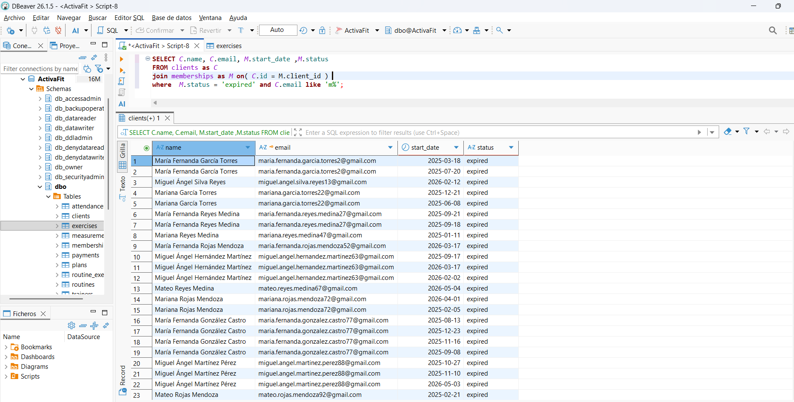3.7 Consultas con filtros condicionales BETWEEN

``` sql
SELECT C.name, C.email, M.start_date ,M.status , PAY.payment_date , PL.name  FROM clients C JOIN memberships M ON C.id = M.client_id JOIN payments PAY ON M.id = PAY.membership_id JOIN plans PL ON PL.id = M.plan_id WHERE PAY.payment_date BETWEEN '2025-01-15 12:26:02' AND '2026-04-21 13:51:24' ORDER BY PAY.payment_date ASC;
```

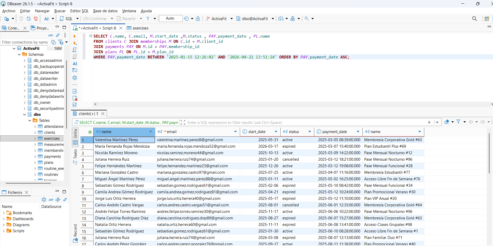

**Forma 2:**

``` sql
SELECT C.name, C.email, M.start_date ,M.status , PAY.payment_date , PL.name  FROM clients C, memberships M, payments PAY, plans PL WHERE C.id = M.client_id   AND M.id = PAY.membership_id   AND PL.id = M.plan_id   AND M.start_date  BETWEEN '2025-01-01' AND '2026-03-30' ORDER BY PAY.payment_date ASC;
```

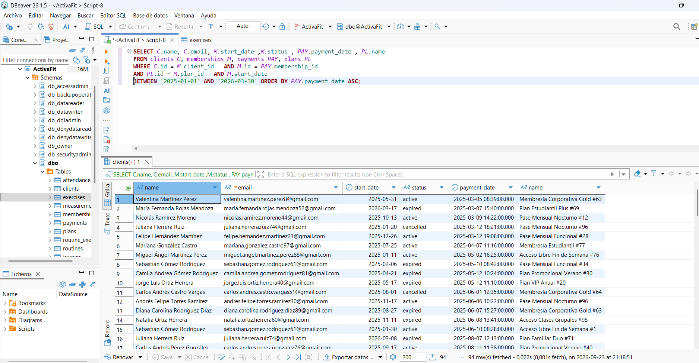

### 3.8 Consultas con agrupamiento GROUP BY 

Se consideran este tipo de consultas cuando tenemos valores que se repiten en los registros.

Si observamos la siguiente consulta:

**Forma 1 con el where:**

``` sql
SELECT  C.id,  C.name,  SUM(P.amount) AS TotalSuma,      COUNT(P.id) AS CuentaTotal,      AVG(P.amount) AS Promedio   FROM clients AS C JOIN memberships AS M ON C.id = M.client_id JOIN payments AS P ON M.id = P.membership_id WHERE P.payment_date BETWEEN '2025-03-01 00:00:00' AND '2026-03-30 23:59:59' GROUP BY C.id, C.name ORDER BY TotalSuma DESC;
```

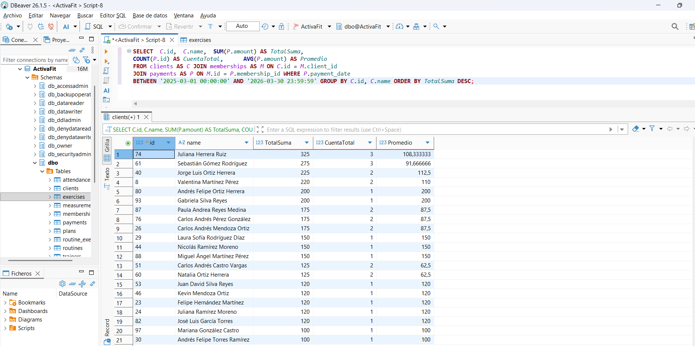

**Forma 1:**

``` sql
SELECT C.id,  C.name,  SUM(P.amount) AS TotalGasto,      COUNT(P.id) AS CantidadPagos FROM clients AS C JOIN memberships AS M ON C.id = M.client_id JOIN payments AS P ON M.id = P.membership_id WHERE P.status = 'pagado' AND P.method = 'tarjeta' GROUP BY C.id, C.name ORDER BY TotalGasto DESC;
```

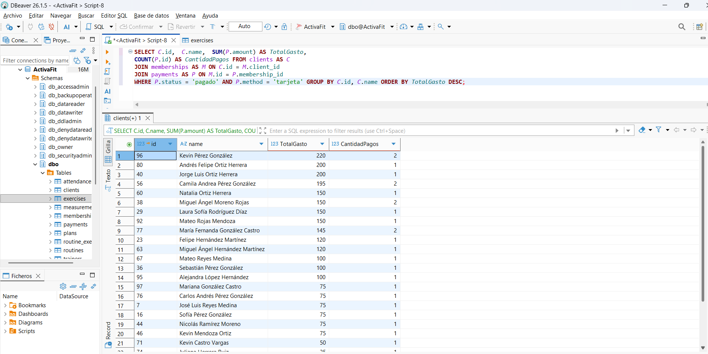

**forma 2 con el having:**

``` sql
SELECT C.id, C.name, SUM(P.amount) AS TotalSuma,  AVG(P.amount) AS PromedioPago FROM clients AS C JOIN memberships AS M ON C.id = M.client_id JOIN payments AS P ON M.id = P.membership_id  GROUP BY C.id, C.name HAVING SUM(P.amount) >= 100  ORDER BY TotalSuma DESC;
```

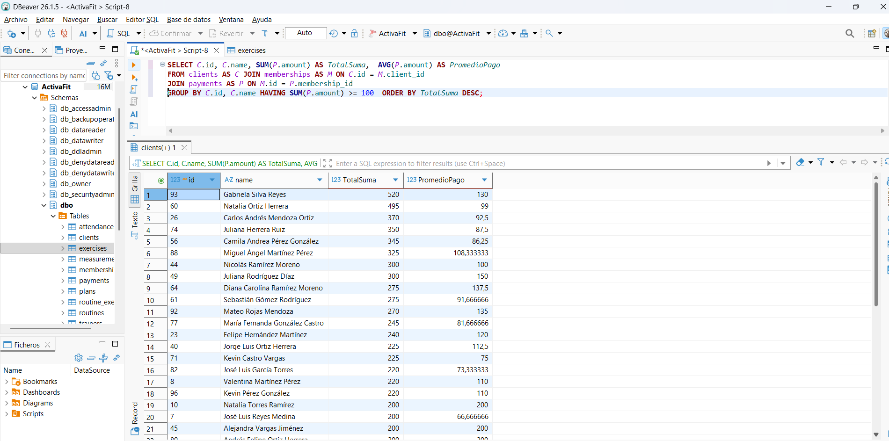

``` sql
SELECT C.id, C.name, C.email,  SUM(P.amount) AS TotalAnual,    COUNT(P.id) AS TotalPagos  FROM clients AS C  JOIN memberships AS M ON C.id = M.client_id JOIN payments AS P ON M.id = P.membership_id WHERE P.payment_date BETWEEN '2025-01-01 00:00:00' AND '2026-12-31 23:59:59'  GROUP BY C.id, C.name, C.email  HAVING COUNT(P.id) >= 3 AND SUM(P.amount) > 100  ORDER BY TotalAnual DESC;
```

### 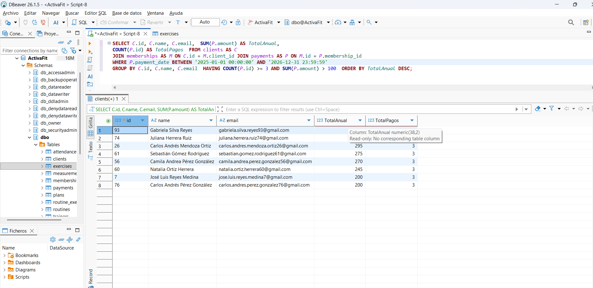3.9 Subconsultas y teoría de conjuntos

En las Sub Consultas podemos realizar la teoría de conjuntos aplicadas a las bases de datos:

la mas conocida es el siguiente caso:

Teniendo en cuenta las tablas entre clientes y membresias, muestre los clientes que no le han realizado membresias en una fecha de inicion.

``` sql
SELECT  *  FROM  clients as C  WHERE  C.id Not In(select M.client_id from memberships as M where M.start_date  BETWEEN  '2025-03-01' and '2026-03-30'); 
```

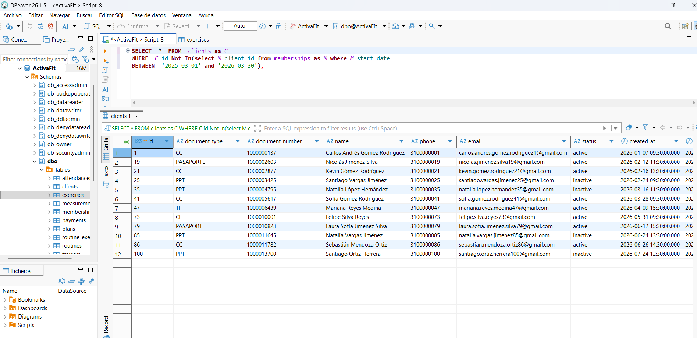

**Forma 2:**

``` sql
select *  from clients as C  left join memberships  as M on(C.id = M.client_id and M.start_date  between '2025-03-01' and '2026-03-30')  where  M.client_id is null;
```

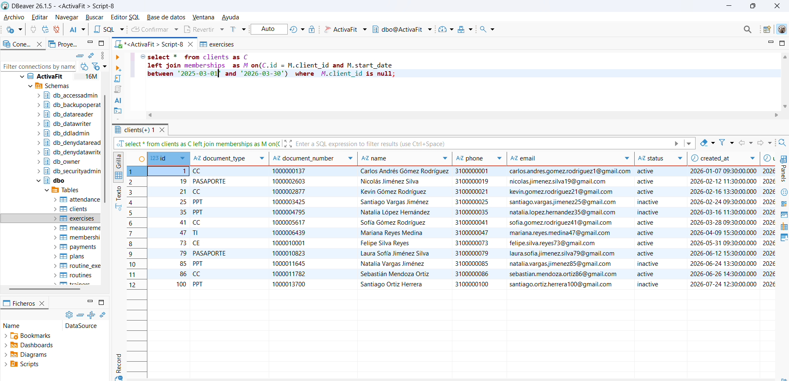

## 4. Consultas avanzadas en Oracle:

#### 4.1 Mostrar algunos de los registros de la tabla TRAINERS

``` sql
SELECT name,phone,email, status FROM TRAINERS  ;
```

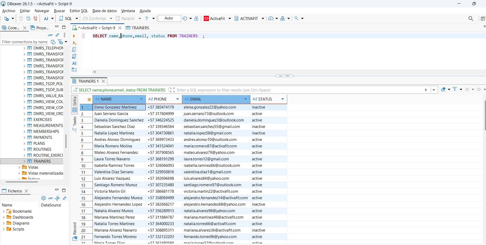

### 4.2 Mostrar de forma ordenada (DESC) el nombre de la tabla routines

``` sql
SELECT name,description,status FROM routines  ORDER BY name DESC;
```

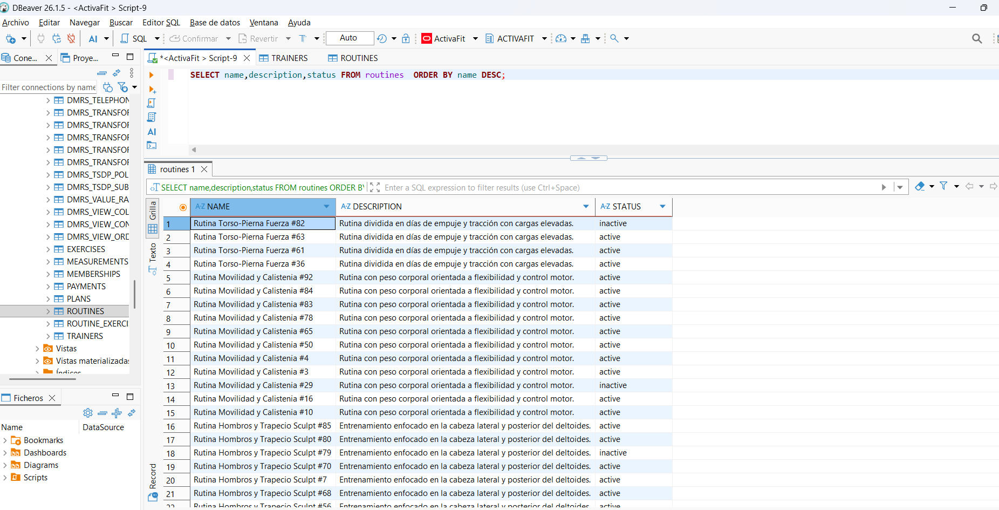

### 4.3 Consultas a múltiples tablas mediante WHERE

``` sql
SELECT C.name,C.DOCUMENT_TYPE ,C.DOCUMENT_NUMBER   ,m.start_date ,m.end_date ,m.status   FROM   clients C, memberships m  WHERE C.id = m.CLIENT_ID ;
```

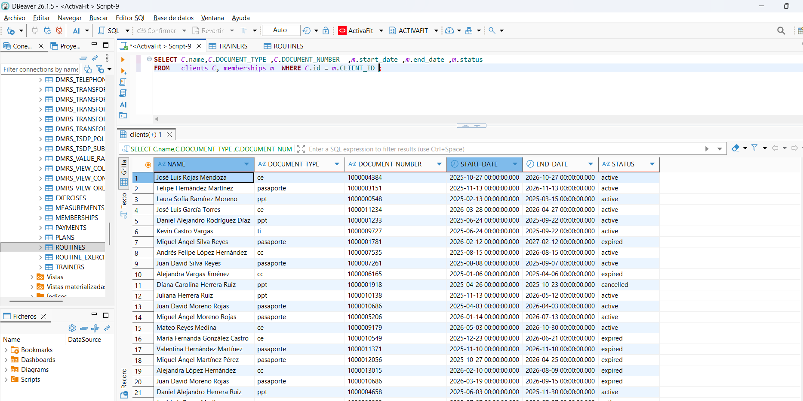

### 4.4 Consultas a múltiples tablas mediante JOIN

``` sql
SELECT C.name, C.email, M.*   FROM clients  C    join memberships  M on( C.id = M.client_id ); 
```

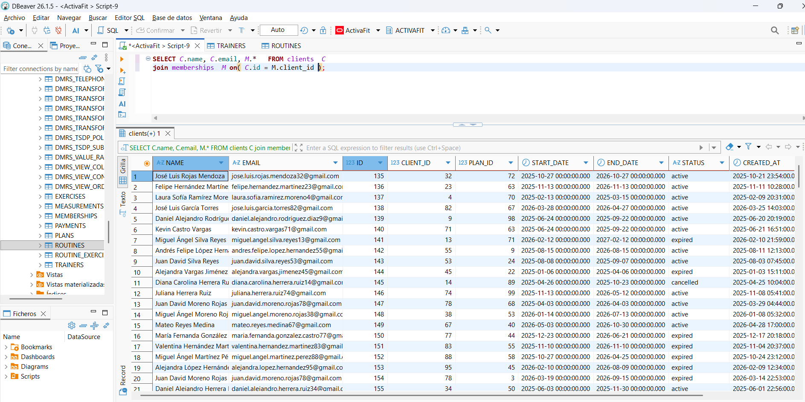

### 4.5 Condiciones en las Consultas o filtros en las Consultas

Para las condiciones se utiliza la clausula Where de la siguiente manera:

Quiero realizar la misma consulta anterior de cualquiera de las dos formas, teniendo en cuenta la condición que presente las ventas de una status especifica.

``` sql
SELECT * FROM memberships m ,clients c  WHERE c.id = m.client_id and m.status ='active';
```

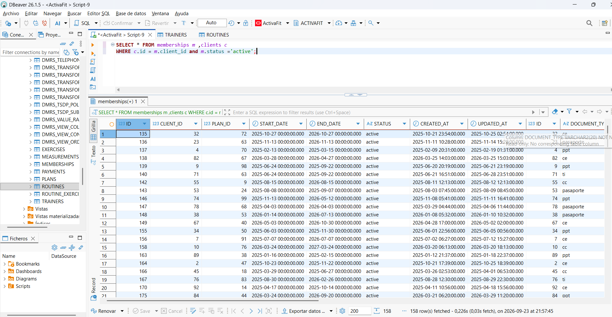

**Forma 2 :**

``` sql
SELECT C.name, C.email,M.start_date ,M.client_id, M.status   
FROM clients C   join memberships M on( C.id = M.client_id )
where  M.status = 'expired'; 
```

### 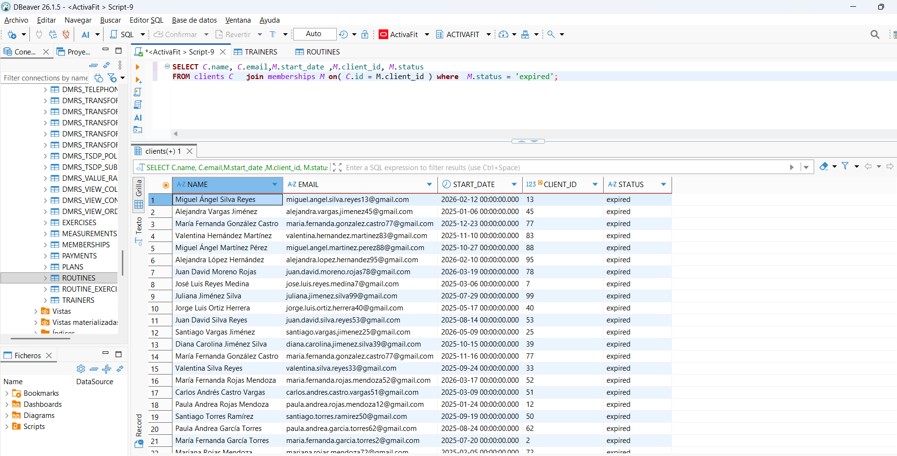4.6 Consultas con filtros condicional LIKE

``` sql
select *  from clients  C  where C.email like 'm%';
```

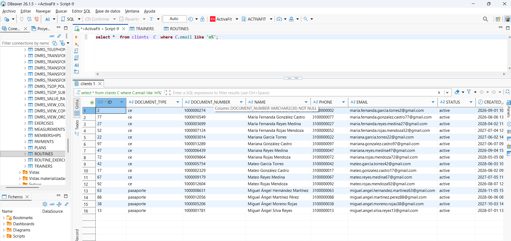

**Mostrar todos los correos de los clientes que contengan el dominio gmail**

``` sql
SELECT  id, document_type, document_number, name, email  
FROM clients C  
WHERE C.email LIKE CONCAT(CONCAT('%', 'gmail'), '%');
```

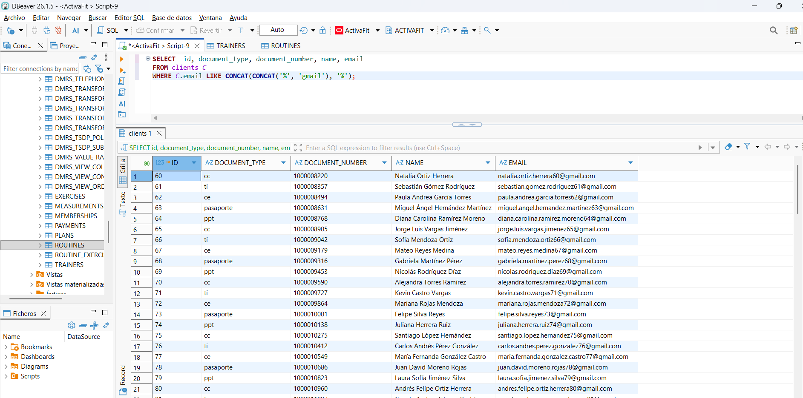

**combinacion del punto anterior y la implementacion de el like**

``` sql
SELECT C.name, C.email, M.start_date ,M.status   
FROM clients C   
join memberships  M on( C.id = M.client_id )  where  M.status = 'expired' and C.email like 'm%'; 
```

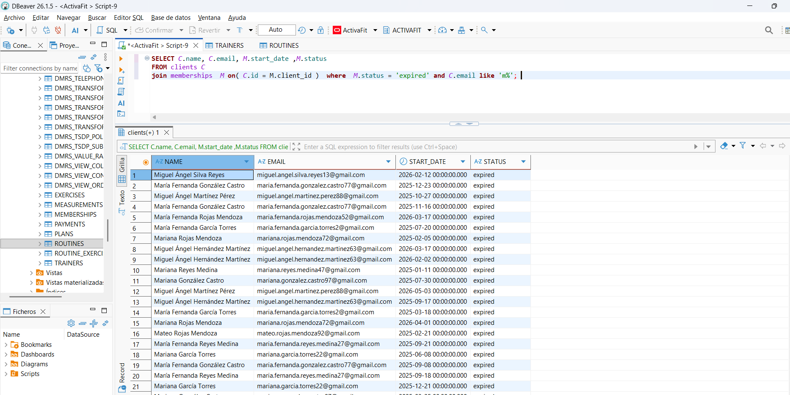

### 4.7 Consultas con filtros condicionales BETWEEN

``` sql
SELECT C.name, C.email, M.start_date ,M.status , PAY.payment_date , PL.name 
FROM clients C 
JOIN memberships M ON C.id = M.client_id
JOIN payments PAY ON M.id = PAY.membership_id 
JOIN plans PL ON PL.id = M.plan_id
WHERE PAY.payment_date BETWEEN TO_TIMESTAMP('2025-02-15 00:00:00', 'YYYY-MM-DD HH24:MI:SS') 
                           AND TO_TIMESTAMP('2026-03-05 00:00:00', 'YYYY-MM-DD HH24:MI:SS')
ORDER BY PAY.payment_date ASC;
```

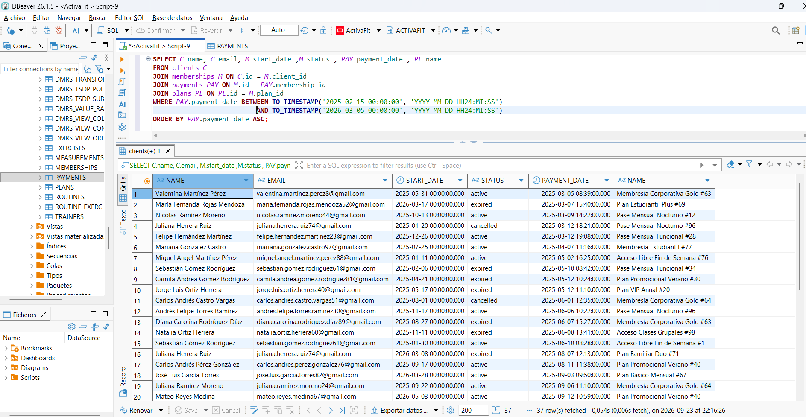

**Forma 2:**

``` sql
SELECT C.name, C.email, M.start_date ,M.status , PAY.payment_date , PL.name  
FROM clients C, memberships M, payments PAY, plans PL
WHERE C.id = M.client_id
  AND M.id = PAY.membership_id
  AND PL.id = M.plan_id
  AND M.start_date BETWEEN TO_DATE('2025-01-01', 'YYYY-MM-DD') 
                       AND TO_DATE('2026-03-30', 'YYYY-MM-DD')
ORDER BY PAY.payment_date ASC;
```

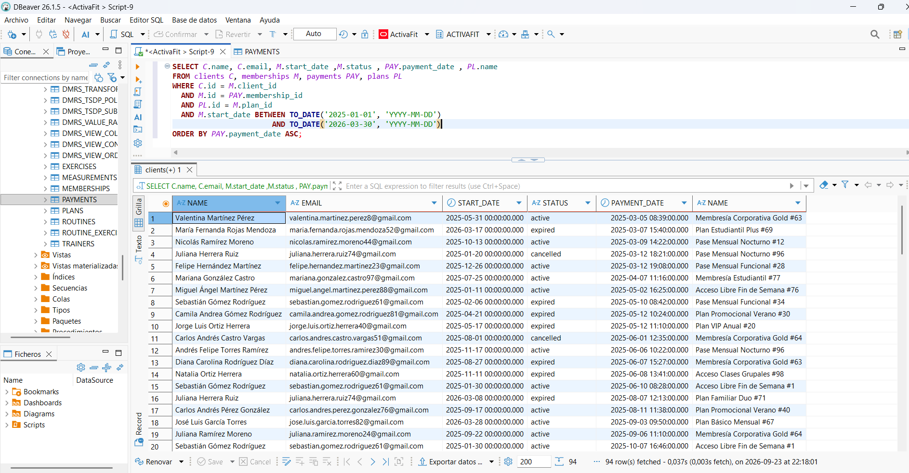

### 4.8 Consultas con agrupamiento GROUP BY 

Se consideran este tipo de consultas cuando tenemos valores que se repiten en los registros.

Si observamos la siguiente consulta:

**Forma 1 con el where:**

``` sql
SELECT  C.id,  C.name,  SUM(P.amount) AS TotalSuma,  COUNT(P.id) AS CuentaTotal, 
    ROUND(AVG(P.amount), 2) AS Promedio 
FROM clients C
JOIN memberships M ON C.id = M.client_id
JOIN payments P ON M.id = P.membership_id
WHERE P.payment_date BETWEEN TIMESTAMP '2025-03-01 00:00:00'
                         AND TIMESTAMP '2026-03-30 23:59:59'
GROUP BY C.id, C.name
ORDER BY TotalSuma DESC;
```

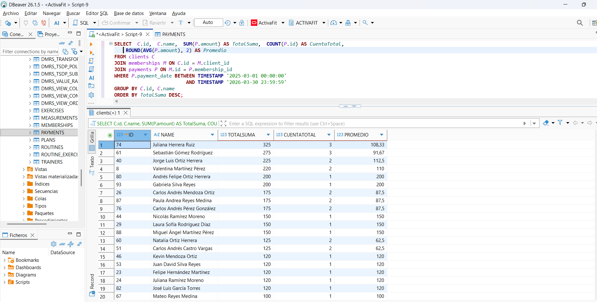

**Forma 1:**

``` sql
SELECT  C.id,  C.name,  SUM(P.amount) AS TotalGasto, 
    COUNT(P.id) AS CantidadPagos
FROM clients C
JOIN memberships M ON C.id = M.client_id
JOIN payments P ON M.id = P.membership_id
WHERE LOWER(P.status) = 'pagado' 
  AND LOWER(P.method) = 'tarjeta'
GROUP BY C.id, C.name
ORDER BY TotalGasto DESC;
```

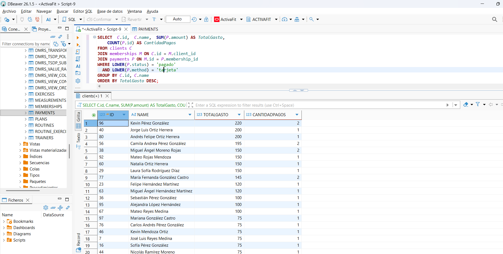

**forma 2 con el having:**

``` sql
SELECT C.id, C.name, SUM(P.amount) AS TotalSuma, 
    ROUND(AVG(P.amount), 2) AS PromedioPago
FROM clients C
JOIN memberships M ON C.id = M.client_id
JOIN payments P ON M.id = P.membership_id
GROUP BY C.id, C.name
HAVING SUM(P.amount) >= 100
ORDER BY TotalSuma DESC;
```

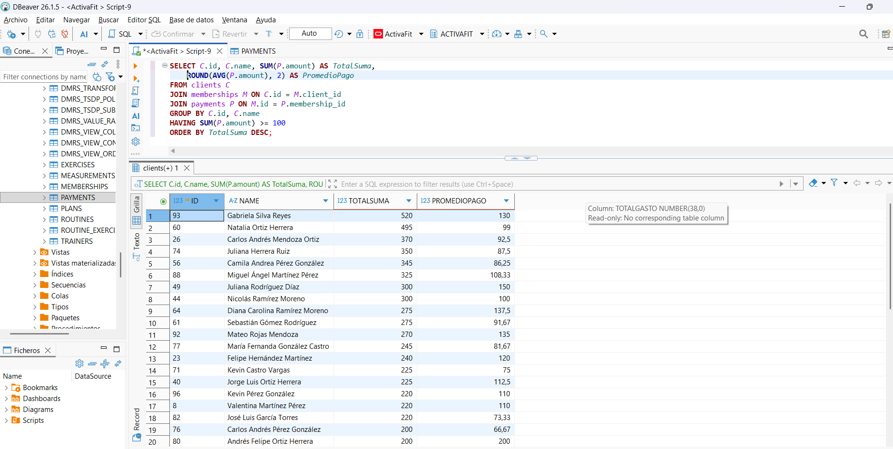

``` sql
SELECT  C.id, C.name, C.email, SUM(P.amount) AS TotalAnual, COUNT(P.id) AS TotalPagos
FROM clients C
JOIN memberships M ON C.id = M.client_id
JOIN payments P ON M.id = P.membership_id
WHERE P.payment_date BETWEEN TIMESTAMP '2025-01-01 00:00:00' 
                         AND TIMESTAMP '2026-12-31 23:59:59'
GROUP BY C.id, C.name, C.email
HAVING COUNT(P.id) >= 3 AND SUM(P.amount) > 100
ORDER BY TotalAnual DESC;
```

### 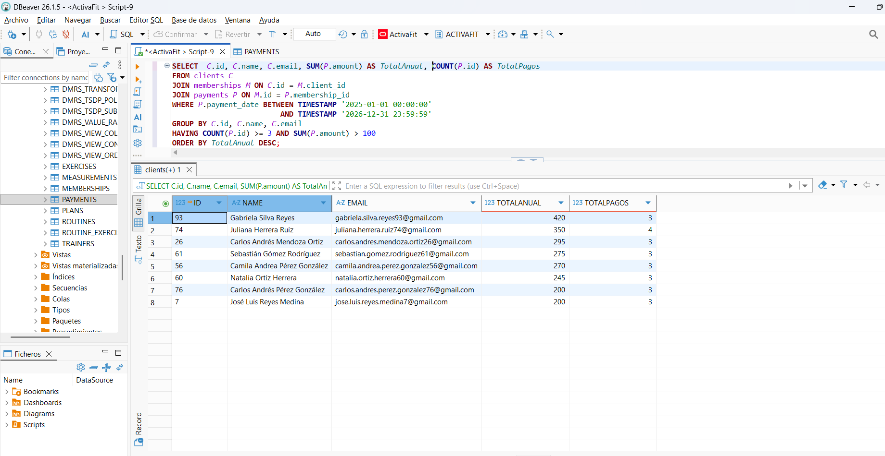4.9 Subconsultas y teoría de conjuntos

En las Sub Consultas podemos realizar la teoría de conjuntos aplicadas a las bases de datos:

la mas conocida es el siguiente caso:

Teniendo en cuenta las tablas entre clientes y membresias, muestre los clientes que no le han realizado membresias en una fecha de inicion.

``` sql
SELECT * 
FROM clients C 
WHERE C.id NOT IN (SELECT M.client_id FROM memberships M 
    WHERE M.client_id IS NOT NULL 
      AND M.start_date BETWEEN DATE '2025-03-01' AND DATE '2026-03-30'
);
```

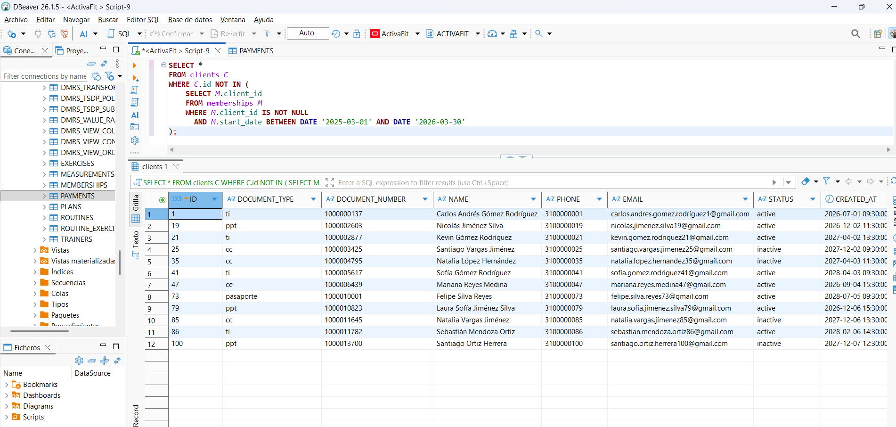

**Forma 2:**

``` sql
SELECT C.* 
FROM clients C 
LEFT JOIN memberships M ON C.id = M.client_id 
 AND M.start_date BETWEEN DATE '2025-03-01' AND DATE '2026-03-30'
WHERE M.client_id IS NULL;
```

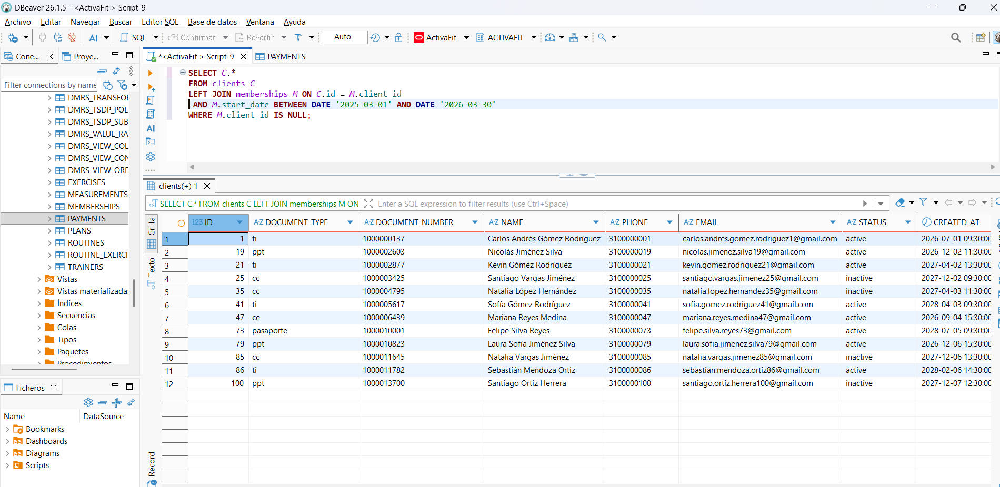

### CONCLUSION

La verdad, la practica de las consultas me sirvió mucho más allá de escribir código, la idea principal fue aprender a **pensar en tablas y relaciones**, dándome cuenta de que un mismo problema —como sacar métricas de clientes o ver quiénes están inactivos— lo puedo resolver de varias formas con joins, agrupaciones o subconsultas.
