# CONSULTAS AVANZANDAS SQL

## Imagenes de los registros de cada tabla creada :

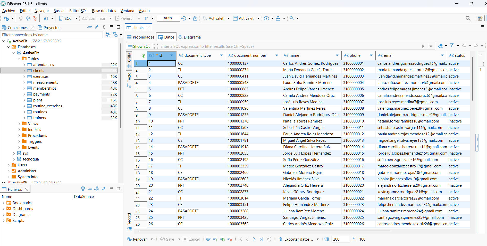

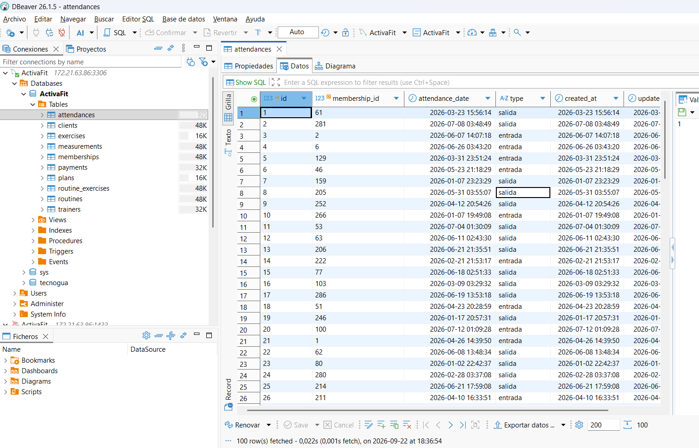

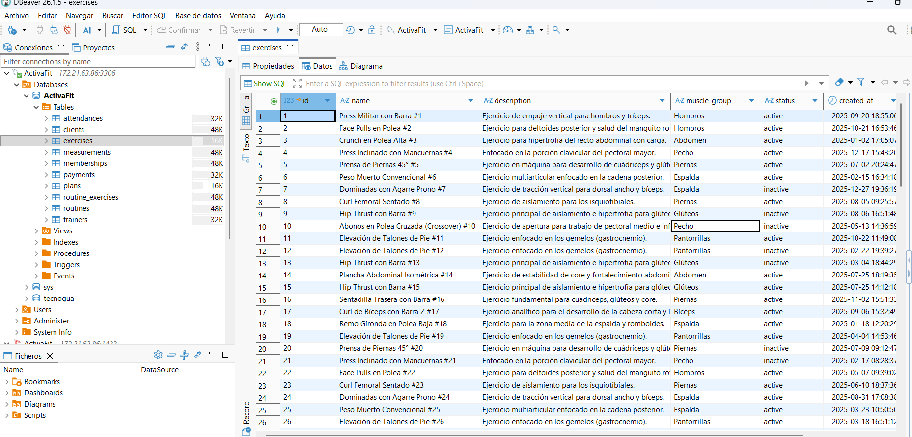

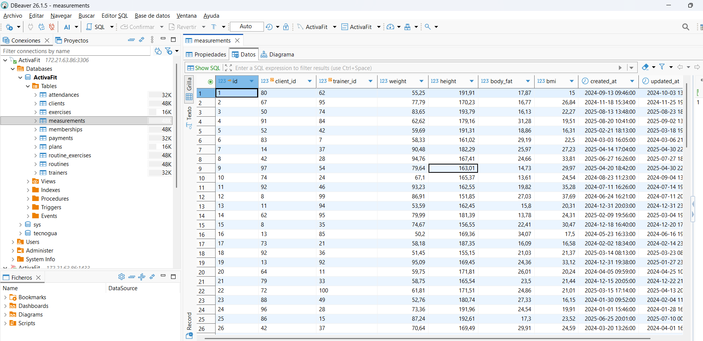

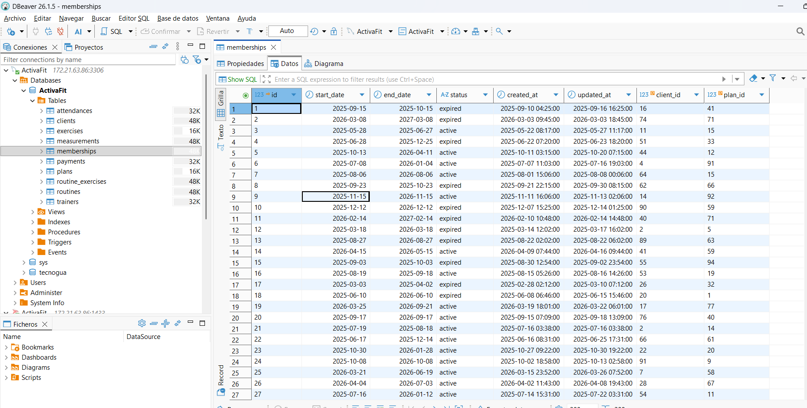

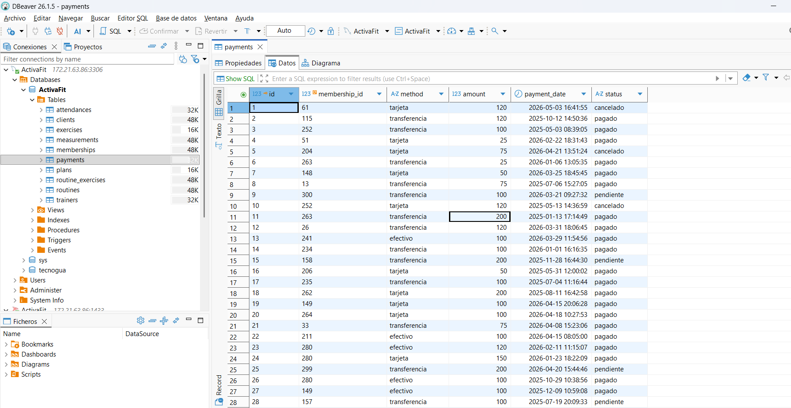

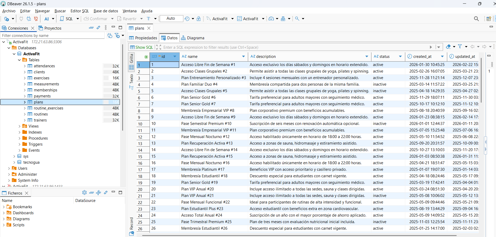

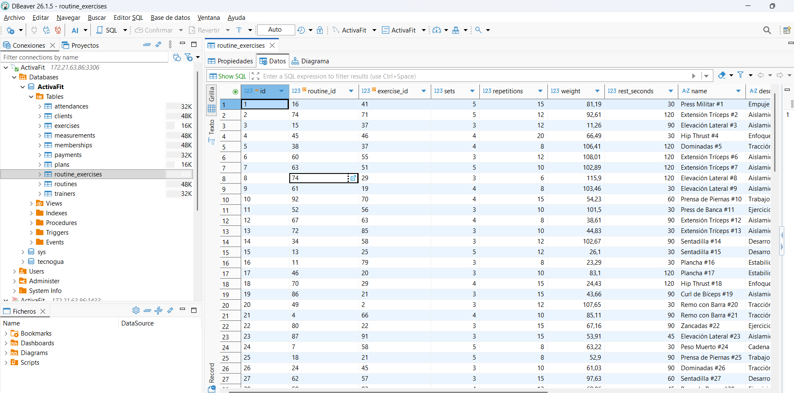

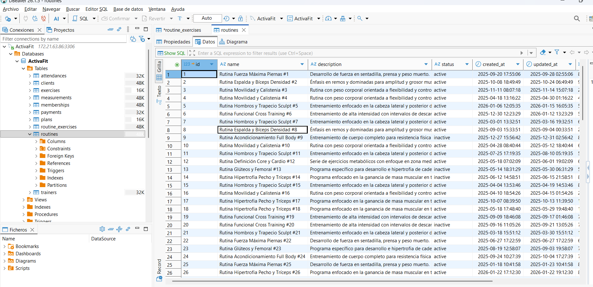

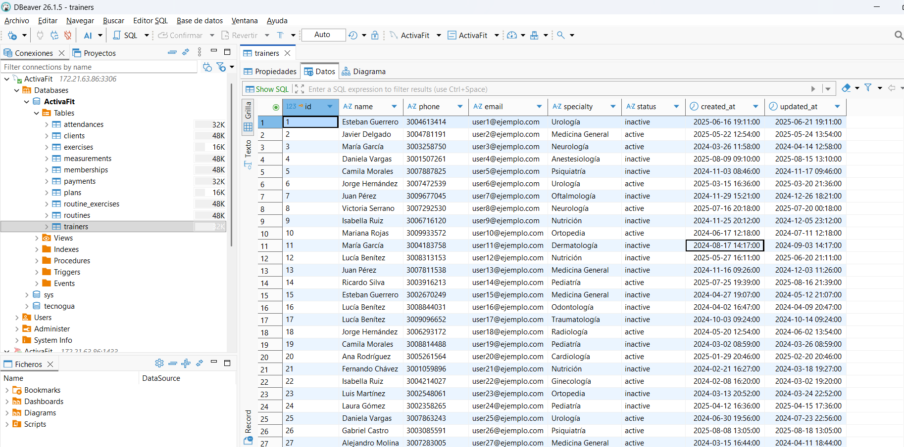

## 1. Consultas avanzadas en MySQL :

#### 1.1 Mostrar algunos  de los registros de la tabla clients

``` sql
SELECT name,document_type, document_number, status FROM clients;
```

## 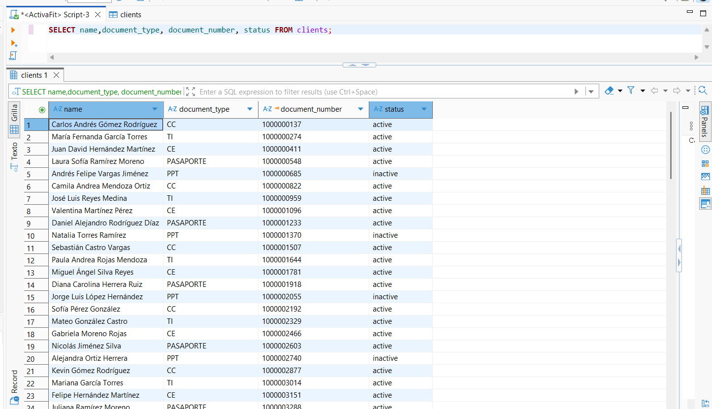

### 1.2 Mostrar de  forma ordenada (DESC) las membresias desde su comienzo

``` sql
SELECT id, start_date, end_date, status FROM memberships   ORDER BY start_date DESC;
```

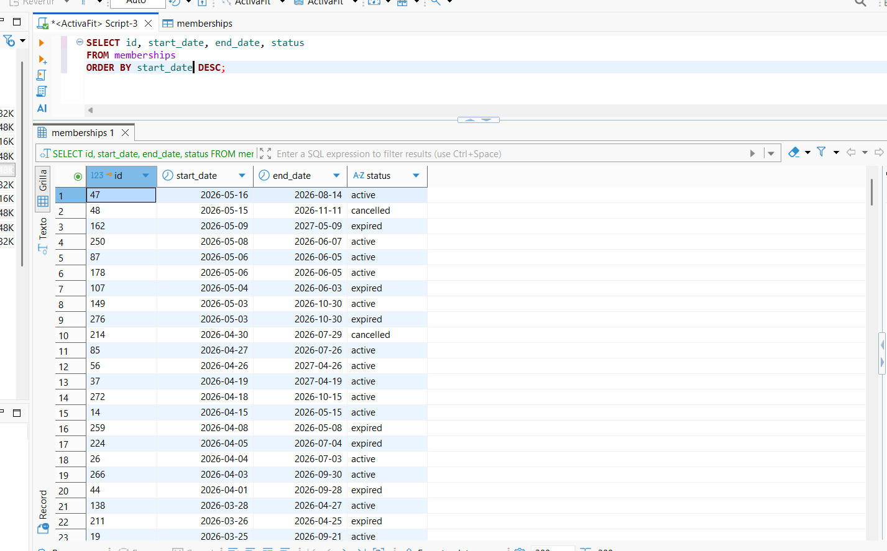

### 1.3 Consultas a múltiples tablas mediante  WHERE 

``` sql
SELECT *
FROM memberships m ,clients c 
WHERE c.id = m.client_id;
```

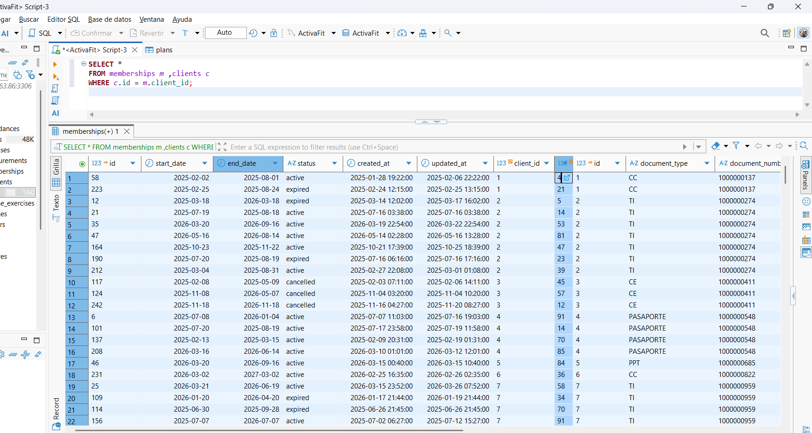

### 1.4 Consultas a múltiples tablas mediante JOIN

``` sql
SELECT C.name, C.email, M.* 
FROM clients as C 
join memberships as M on( C.id = M.client_id ); 
```

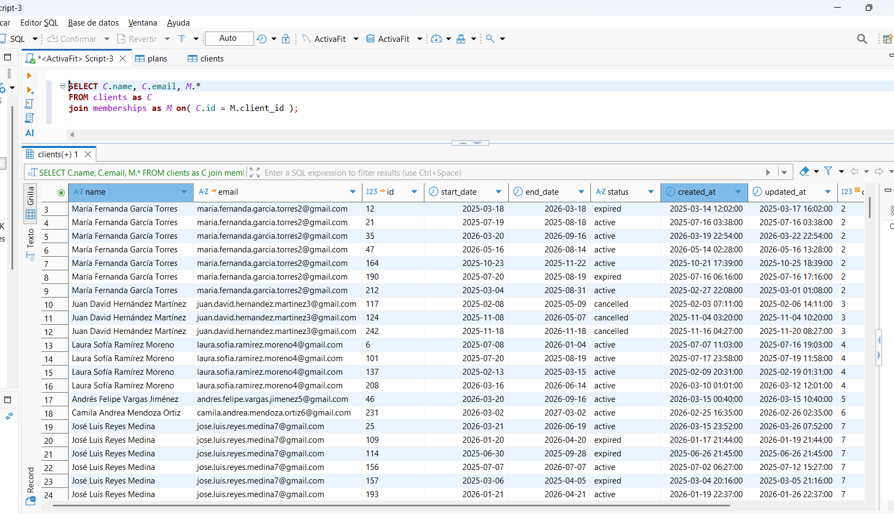

### 1.5 Condiciones en las Consultas o filtros en las Consultas

Para las condiciones se utiliza la clausula Where de la siguiente manera:

Quiero realizar la misma consulta anterior de cualquiera de las dos formas, teniendo en cuenta la condición que presente las ventas de una fecha especifica.

``` sql
SELECT *
FROM memberships m ,clients c 
WHERE c.id = m.client_id and m.status ="active";
```

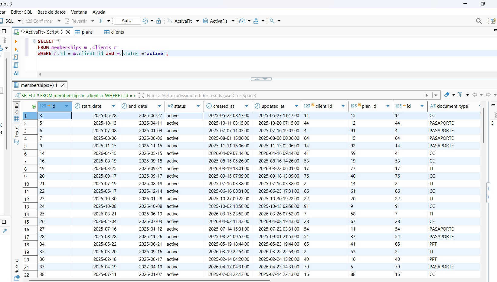

``` sql
SELECT C.name, C.email, M.* 
FROM clients as C 
join memberships as M on( C.id = M.client_id ) 
where  M.status = "expired"; 
```

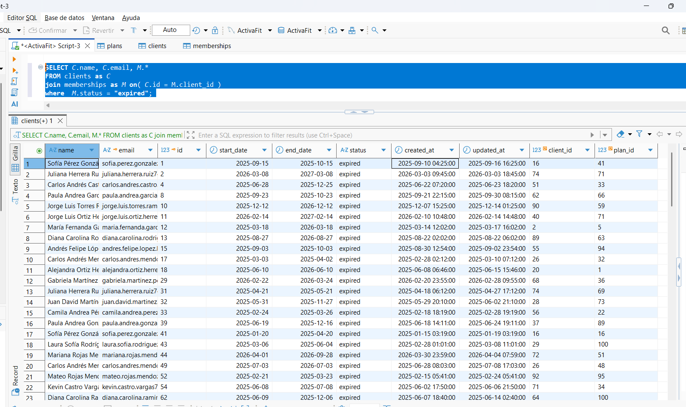
