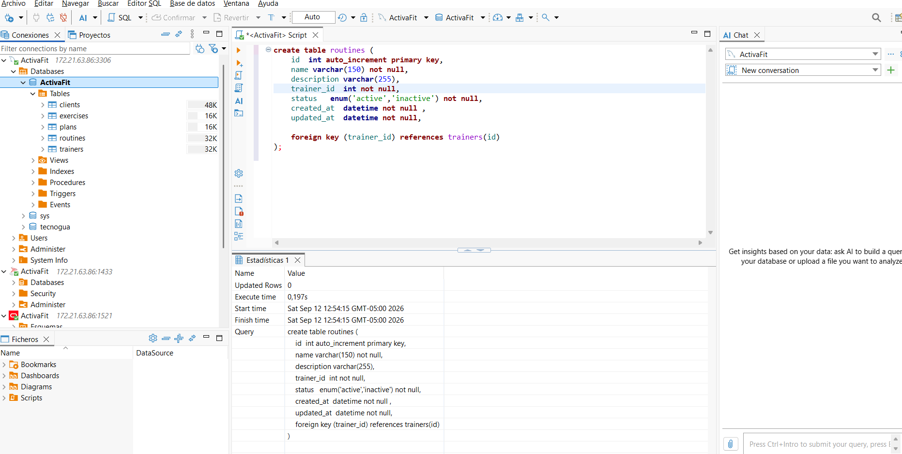
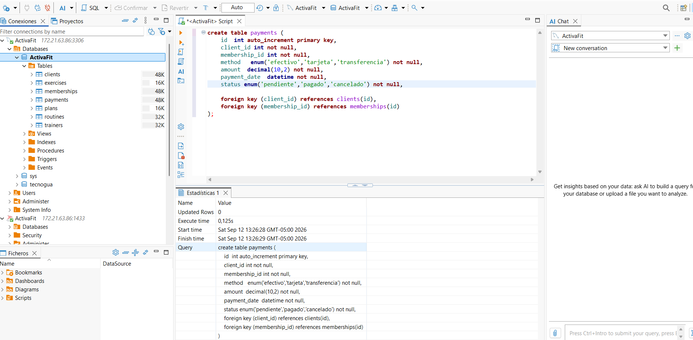
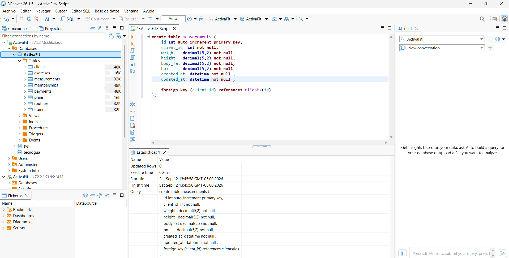
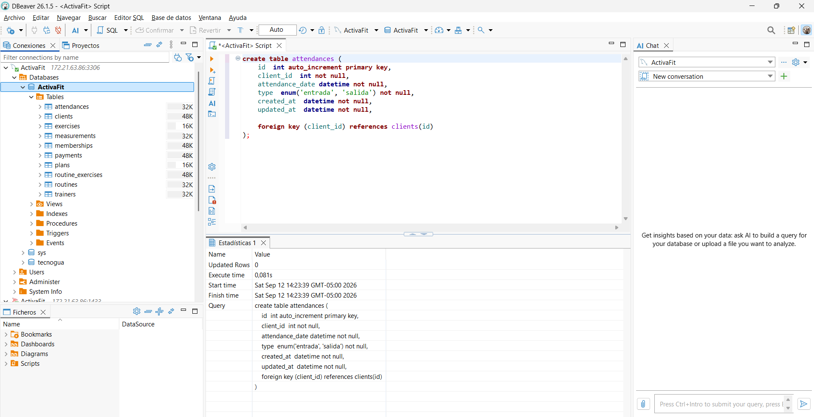

# CREACION DE BASE DE DATOS

## 1. Base de Datos MySQL

### 1.1 Creacion de Base de Datos por el terminal de DBeaver

``` sql
create database ActivaFit;
```


#### 1.2 Creacion de la tabla clients

``` sql
create table clients (
    id  int auto_increment primary key,
    document_type   enum('CC', 'TI', 'CE', 'PASAPORTE', 'PPT') not null,
    document_number varchar(30) not null unique,
    name            varchar(150) not null,
    phone           varchar(30),
    email           varchar(150) not null unique,
    status          enum('active','inactive') not null ,
    created_at      datetime not null ,
    updated_at      datetime not null
);
```


#### 1.3 Creacion de la tabla plans

``` sql
create table plans (
    id          int auto_increment primary key,
    name        varchar(100) not null,
    description varchar(255),
    status      enum('active','inactive') not null ,
    created_at  datetime not null ,
    updated_at  datetime not null 
);
```


#### 1.4 Creacion de la tabla trainers

``` sql
create table trainers (
    id int auto_increment primary key,
    name  varchar(150) not null,
    phone   varchar(30),
    email    varchar(150) unique,
    specialty  varchar(150),
    status      enum('active','inactive') not null,
    created_at  datetime not null ,
    updated_at  datetime not null 
);
```

{width="575"}

#### 1.5 Creacion de la tabla exercises

``` sql
create table exercises (
    id   int auto_increment primary key,
    name   varchar(150) not null,
    description  varchar(255),
    muscle_group varchar(100),
    status  enum('active','inactive') not null ,
    created_at  datetime not null ,
    updated_at  datetime not null 
);
```


#### 1.6 Creacion de la tabla routines

``` sql
create table routines (
    id  int auto_increment primary key,
    name varchar(150) not null,
    description varchar(255),
    trainer_id  int not null,
    status   enum('active','inactive') not null,
    created_at  datetime not null ,
    updated_at  datetime not null,

    foreign key (trainer_id) references trainers(id)
);
```



#### 1.7 Creacion de la tabla memberships

``` sql
create table memberships (
    id  int auto_increment primary key,
    client_id  int not null,
    plan_id    int not null,
    start_date date not null,
    end_date   date not null,
    status   enum('active','expired','cancelled') not null,
    created_at  datetime not null,
    updated_at  datetime not null,

    foreign key (client_id) references clients(id),
    foreign key (plan_id) references plans(id)
);
```


#### 1.8 Creacion de la tabla payments

``` sql
create table payments (
    id  int auto_increment primary key,
    client_id int not null,
    membership_id int not null,
    method   enum('efectivo','tarjeta','transferencia') not null,
    amount  decimal(10,2) not null,
    payment_date  datetime not null,
    status enum('pendiente','pagado','cancelado') not null,

    foreign key (client_id) references clients(id),
    foreign key (membership_id) references memberships(id)
);
```



#### 1.9 Creacion de la tabla measurements

``` sql
create table measurements (
    id int auto_increment primary key,
    client_id  int not null,
    weight   decimal(5,2) not null,
    height   decimal(5,2) not null,
    body_fat decimal(5,2) not null,
    bmi      decimal(5,2) not null,
    created_at  datetime not null ,
    updated_at  datetime not null ,

    foreign key (client_id) references clients(id)
);
```



#### 1.10 Creacion de la tabla routine_exercises

``` sql
create table routine_exercises (
    id int auto_increment primary key,
    routine_id   int not null,
    exercise_id  int not null,
    sets  int not null,
    repetitions  int not null,
    weight decimal(10,2),
    rest_seconds int not null,

    foreign key (routine_id) references routines(id),
    foreign key (exercise_id) references exercises(id),

    unique (routine_id, exercise_id)
);
```


#### 1.11 Creacion de la tabla attendances

``` sql
create table attendances (
    id  int auto_increment primary key,
    client_id  int not null,
    attendance_date datetime not null,
    type  enum('entrada', 'salida') not null,
    created_at  datetime not null,
    updated_at  datetime not null,

    foreign key (client_id) references clients(id)
);
```



#### Conclusion

Con esto se ha finalizado las creacion de la base de datos de MySQL por terminal de DBeaver, como resultado tenemos las 10 tablas creadas correctamente.

### 2. Creacion de Base de Datos de forma visual por el gestor MySQL workbench

### 2.1 Creamos la base de datos ActivaFit visualmente


#### como resultado tenemos esto:


### 2.2 Creacion de la tabla clients


**Evidencia de la creacion:**


